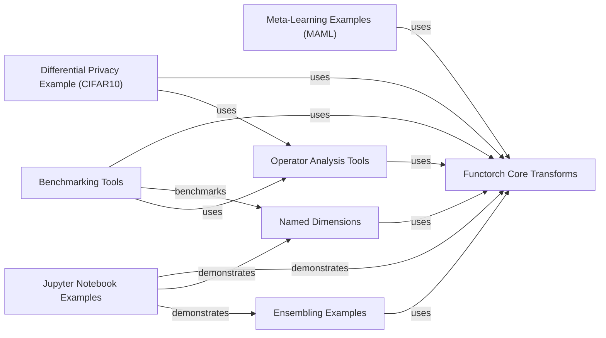

## Component Details

Functorch provides composable function transforms for PyTorch, enabling features like vectorization, automatic differentiation, and stateless functions. The core of functorch lies in its functional transforms like `vmap`, `grad`, `jacrev`, and `hessian`, which are used to manipulate and transform functions. These transforms are then utilized in various examples and applications, such as meta-learning, differential privacy, and ensembling. The library also provides tools for operator analysis and benchmarking, as well as integration with other libraries like `einops` for tensor manipulation. Named dimensions are introduced to improve code readability. Jupyter notebooks provide tutorials and examples for users to learn how to use Functorch.

### Functorch Core Transforms
This component encompasses the core function transforms provided by Functorch, such as `vmap`, `grad`, `jacrev`, and `hessian`. These transforms enable vectorization, automatic differentiation, and other functional programming paradigms within PyTorch. It also includes the underlying mechanisms for these transforms.
- **Related Classes/Methods**: `pytorch.functorch`, `pytorch.torch._functorch`

### Meta-Learning Examples (MAML)
This component provides examples of using Functorch for Model-Agnostic Meta-Learning (MAML) on regression and Omniglot datasets. It includes implementations of neural networks, loss functions, and task sampling procedures specific to MAML.
- **Related Classes/Methods**: `functorch.examples.maml_regression`, `functorch.examples.maml_omniglot`

### Differential Privacy Example (CIFAR10)
This component demonstrates how Functorch can be used to train a CIFAR10 image classification model with differential privacy. It includes functions for computing norms, clipping gradients, adding noise, and saving checkpoints, showcasing the use of Functorch in privacy-preserving machine learning.
- **Related Classes/Methods**: `functorch.examples.dp_cifar10`

### Ensembling Examples
This component demonstrates ensembling techniques using Functorch, where multiple models are trained in parallel and their predictions are combined to improve accuracy. It showcases the use of Functorch for parallelizing model training and aggregation.
- **Related Classes/Methods**: `functorch.examples.ensembling`

### Operator Analysis Tools
This component provides tools for analyzing PyTorch operators, potentially for performance optimization or debugging. It allows users to gain insights into the behavior of operators and identify potential bottlenecks.
- **Related Classes/Methods**: `functorch.op_analysis`

### Benchmarking Tools
This component provides benchmarking tools for evaluating the performance of Functorch and comparing it to other PyTorch implementations. It allows users to measure the speed and efficiency of Functorch code.
- **Related Classes/Methods**: `functorch.benchmarks`

### Jupyter Notebook Examples
This component contains Jupyter notebooks that demonstrate various functionalities of Functorch, such as plotting per-sample gradients, Jacobians, Hessians, and ensembling. These notebooks serve as tutorials and examples for users to learn how to use Functorch.
- **Related Classes/Methods**: `functorch.notebooks`

### Named Dimensions
This component introduces named dimensions to PyTorch tensors, allowing users to refer to tensor dimensions by name instead of index. This can improve code readability and reduce errors in tensor manipulations.
- **Related Classes/Methods**: `pytorch.functorch.dim`
