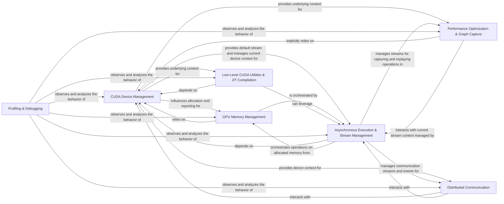

## Details

The CUDA Backend subsystem serves as a critical abstraction layer within PyTorch, interfacing with NVIDIA GPUs via CUDA to offload computations and achieve high performance. Its boundaries are primarily defined by the torch.cuda Python package and its underlying C++ implementations found in torch.csrc.cuda. This subsystem encapsulates all functionalities required for direct interaction with CUDA devices, memory management, asynchronous execution, and performance optimization on NVIDIA hardware.

### CUDA Device Management
Manages fundamental CUDA device interactions, including initialization, device property queries (get_device_properties, get_device_capability), device selection (set_device, current_device), and overall CUDA availability checks (is_available). It also handles lazy initialization and manages the state of CUDA-specific random number generators (get_rng_state, set_rng_state, manual_seed) for reproducible operations on the GPU.

**Related Classes/Methods**:

- <a href="https://github.com/pytorch/pytorch/blob/main/torch/cuda/__init__.py" target="_blank" rel="noopener noreferrer">`torch.cuda.get_device_properties`</a>
- <a href="https://github.com/pytorch/pytorch/blob/main/torch/cuda/__init__.py" target="_blank" rel="noopener noreferrer">`torch.cuda.get_device_capability`</a>
- <a href="https://github.com/pytorch/pytorch/blob/main/torch/cuda/__init__.py" target="_blank" rel="noopener noreferrer">`torch.cuda.set_device`</a>
- <a href="https://github.com/pytorch/pytorch/blob/main/torch/cuda/__init__.py" target="_blank" rel="noopener noreferrer">`torch.cuda.current_device`</a>
- <a href="https://github.com/pytorch/pytorch/blob/main/torch/cuda/__init__.py" target="_blank" rel="noopener noreferrer">`torch.cuda.is_available`</a>
- <a href="https://github.com/pytorch/pytorch/blob/main/torch/cuda/random.py" target="_blank" rel="noopener noreferrer">`torch.cuda.get_rng_state`</a>
- <a href="https://github.com/pytorch/pytorch/blob/main/torch/cuda/random.py" target="_blank" rel="noopener noreferrer">`torch.cuda.set_rng_state`</a>
- <a href="https://github.com/pytorch/pytorch/blob/main/torch/cuda/random.py" target="_blank" rel="noopener noreferrer">`torch.cuda.manual_seed`</a>

### GPU Memory Management
Manages GPU memory allocation, deallocation, and caching. This component provides functions for querying memory statistics (memory_stats, memory_allocated, memory_reserved), clearing the cache (empty_cache), and configuring memory allocation behavior. It is crucial for efficient resource utilization and preventing out-of-memory errors.

**Related Classes/Methods**:

- <a href="https://github.com/pytorch/pytorch/blob/main/torch/cuda/memory.py" target="_blank" rel="noopener noreferrer">`torch.cuda.memory_stats`</a>
- <a href="https://github.com/pytorch/pytorch/blob/main/torch/cuda/memory.py" target="_blank" rel="noopener noreferrer">`torch.cuda.memory_allocated`</a>
- <a href="https://github.com/pytorch/pytorch/blob/main/torch/cuda/memory.py" target="_blank" rel="noopener noreferrer">`torch.cuda.memory_reserved`</a>
- <a href="https://github.com/pytorch/pytorch/blob/main/torch/cuda/memory.py" target="_blank" rel="noopener noreferrer">`torch.cuda.empty_cache`</a>
- <a href="https://github.com/pytorch/pytorch/blob/main/torch/cuda/_pin_memory_utils.py" target="_blank" rel="noopener noreferrer">`torch.cuda._pin_memory_utils`</a>

### Asynchronous Execution & Stream Management
Facilitates asynchronous execution of CUDA operations through the management of CUDA streams (Stream) and events (Event). This includes creating, recording, waiting on, and synchronizing streams and events (record_event, wait_event, synchronize), which are crucial for overlapping computations and data transfers to maximize GPU utilization.

**Related Classes/Methods**:

- <a href="https://github.com/pytorch/pytorch/blob/main/torch/cuda/streams.py" target="_blank" rel="noopener noreferrer">`torch.cuda.Stream`</a>
- <a href="https://github.com/pytorch/pytorch/blob/main/torch/cuda/streams.py" target="_blank" rel="noopener noreferrer">`torch.cuda.Event`</a>
- <a href="https://github.com/pytorch/pytorch/blob/main/torch/cuda/streams.py" target="_blank" rel="noopener noreferrer">`torch.cuda.record_event`</a>
- <a href="https://github.com/pytorch/pytorch/blob/main/torch/cuda/streams.py" target="_blank" rel="noopener noreferrer">`torch.cuda.wait_event`</a>
- <a href="https://github.com/pytorch/pytorch/blob/main/torch/cuda/streams.py" target="_blank" rel="noopener noreferrer">`torch.cuda.synchronize`</a>

### Performance Optimization & Graph Capture
Provides advanced techniques for optimizing CUDA computations. This includes Automatic Mixed Precision (AMP) via autocast and GradScaler for performance gains with reduced precision (e.g., float16), capturing sequences of operations into static CUDA graphs (capture_begin, capture_end, replay) for efficient replay, and other utilities for fine-tuning kernel implementations (torch.cuda.tunable).

**Related Classes/Methods**:

- <a href="https://github.com/pytorch/pytorch/blob/main/torch/cuda/amp/__init__.py" target="_blank" rel="noopener noreferrer">`torch.cuda.amp.autocast`</a>
- <a href="https://github.com/pytorch/pytorch/blob/main/torch/cuda/amp/__init__.py" target="_blank" rel="noopener noreferrer">`torch.cuda.amp.GradScaler`</a>
- <a href="https://github.com/pytorch/pytorch/blob/main/torch/cuda/graphs.py" target="_blank" rel="noopener noreferrer">`torch.cuda.capture_begin`</a>
- <a href="https://github.com/pytorch/pytorch/blob/main/torch/cuda/graphs.py" target="_blank" rel="noopener noreferrer">`torch.cuda.capture_end`</a>
- <a href="https://github.com/pytorch/pytorch/blob/main/torch/cuda/graphs.py" target="_blank" rel="noopener noreferrer">`torch.cuda.replay`</a>
- <a href="https://github.com/pytorch/pytorch/blob/main/torch/cuda/tunable.py" target="_blank" rel="noopener noreferrer">`torch.cuda.tunable`</a>

### Low-Level CUDA Utilities & JIT Compilation
Offers lower-level helper functions for direct interaction with the CUDA driver API, including loading CUDA libraries and compiling kernels (torch.cuda._utils). It also enables Just-In-Time (JIT) compilation of element-wise CUDA kernels (torch.cuda.jiterator), allowing for dynamic kernel generation and execution for specialized operations.

**Related Classes/Methods**:

- <a href="https://github.com/pytorch/pytorch/blob/main/torch/cuda/_utils.py" target="_blank" rel="noopener noreferrer">`torch.cuda._utils`</a>
- <a href="https://github.com/pytorch/pytorch/blob/main/torch/cuda/jiterator.py" target="_blank" rel="noopener noreferrer">`torch.cuda.jiterator`</a>

### Distributed Communication
Handles distributed communication functionalities, primarily through NCCL (NVIDIA Collective Communications Library) for efficient multi-GPU and multi-node communication (torch.cuda.nccl). It also supports GPU Direct Storage (GDS) capabilities (torch.cuda.gds) for high-performance data transfer directly between storage and GPU memory in distributed environments.

**Related Classes/Methods**:

- <a href="https://github.com/pytorch/pytorch/blob/main/torch/cuda/comm.py" target="_blank" rel="noopener noreferrer">`torch.cuda.comm`</a>
- <a href="https://github.com/pytorch/pytorch/blob/main/torch/cuda/nccl.py" target="_blank" rel="noopener noreferrer">`torch.cuda.nccl`</a>
- <a href="https://github.com/pytorch/pytorch/blob/main/torch/cuda/gds.py" target="_blank" rel="noopener noreferrer">`torch.cuda.gds`</a>

### Profiling & Debugging
Provides tools for performance analysis and debugging of CUDA operations. This includes basic profiling capabilities (torch.cuda.profiler), NVTX for custom range and marker annotations for detailed timeline analysis (torch.cuda.nvtx), and sanitizers (torch.cuda._sanitizer) to detect unsynchronized memory accesses and other CUDA-related issues.

**Related Classes/Methods**:

- <a href="https://github.com/pytorch/pytorch/blob/main/torch/cuda/profiler.py" target="_blank" rel="noopener noreferrer">`torch.cuda.profiler`</a>
- <a href="https://github.com/pytorch/pytorch/blob/main/torch/cuda/nvtx.py" target="_blank" rel="noopener noreferrer">`torch.cuda.nvtx`</a>
- <a href="https://github.com/pytorch/pytorch/blob/main/torch/cuda/_sanitizer.py" target="_blank" rel="noopener noreferrer">`torch.cuda._sanitizer`</a>
- <a href="https://github.com/pytorch/pytorch/blob/main/torch/cuda/_memory_viz.py" target="_blank" rel="noopener noreferrer">`torch.cuda._memory_viz`</a>

### [FAQ](https://github.com/CodeBoarding/GeneratedOnBoardings/tree/main?tab=readme-ov-file#faq)