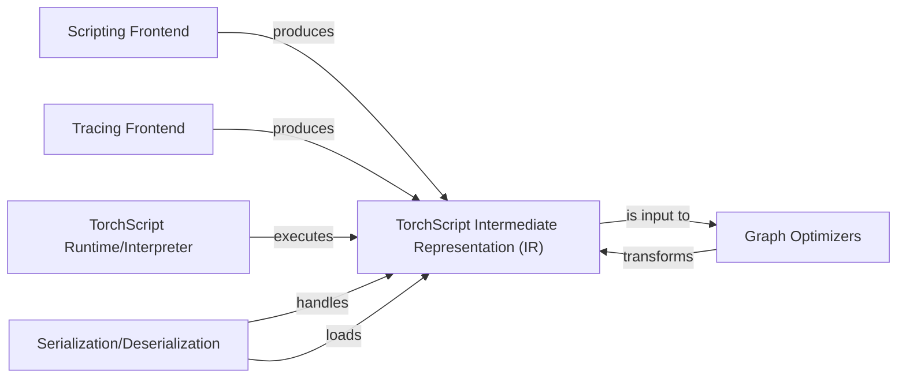

## Details

The TorchScript subsystem in PyTorch provides a way to create serializable and optimizable models from standard PyTorch code. It primarily operates by transforming Python modules and functions into a static graph representation, the TorchScript Intermediate Representation (IR). This transformation can occur either through explicit scripting, where Python code is directly compiled, or through tracing, where a model's execution is recorded. Once in the IR format, the graph undergoes various optimizations to enhance performance. Finally, the optimized graph can be executed by a high-performance runtime, typically implemented in C++, and can be serialized for deployment or deserialized for loading.

### Scripting Frontend
This component is responsible for parsing Python code (modules, functions) and converting it into the TorchScript Intermediate Representation (IR). It handles Python control flow, type annotations, and PyTorch operations, enabling the direct compilation of Python code into a static graph.

**Related Classes/Methods**:

- <a href="https://github.com/pytorch/pytorch/blob/main/" target="_blank" rel="noopener noreferrer">`torch.jit.script`</a>

### Tracing Frontend
This component records the execution of a model with example inputs to build a static computational graph. It's particularly useful for models with dynamic control flow that is input-dependent, capturing the specific execution path taken for given inputs.

**Related Classes/Methods**:

- <a href="https://github.com/pytorch/pytorch/blob/main/" target="_blank" rel="noopener noreferrer">`torch.jit.trace`</a>

### TorchScript Intermediate Representation (IR)
This is the core static graph format used to represent compiled models within the TorchScript ecosystem. It is language-agnostic and optimized for efficient execution and transformation, serving as the common ground for all subsequent optimizations and execution.

**Related Classes/Methods**:

- <a href="https://github.com/pytorch/pytorch/blob/main/" target="_blank" rel="noopener noreferrer">`torch.jit.Graph`</a>

### Graph Optimizers
This component applies various graph-level transformations and optimizations to the TorchScript IR. These optimizations aim to improve performance by reducing redundant computations, fusing operations, and eliminating dead code, among others.

**Related Classes/Methods**:

- <a href="https://github.com/pytorch/pytorch/blob/main/" target="_blank" rel="noopener noreferrer">`torch.jit._passes.common_subexpression_elimination`</a>

### TorchScript Runtime/Interpreter
This component is responsible for executing the optimized TorchScript graph. Typically implemented in C++ for high performance, this runtime can operate independently of the Python interpreter, making it suitable for deployment in production environments.

**Related Classes/Methods**:

- <a href="https://github.com/pytorch/pytorch/blob/main/" target="_blank" rel="noopener noreferrer">`torch.jit.optimize_for_inference`</a>

### Serialization/Deserialization
This component enables saving (serializing) TorchScript models to disk and loading (deserializing) them back into memory. This is a crucial capability for model persistence, sharing, and deployment across different environments.

**Related Classes/Methods**:

- <a href="https://github.com/pytorch/pytorch/blob/main/" target="_blank" rel="noopener noreferrer">`torch.jit.save`</a>
- <a href="https://github.com/pytorch/pytorch/blob/main/" target="_blank" rel="noopener noreferrer">`torch.jit.load`</a>

### [FAQ](https://github.com/CodeBoarding/GeneratedOnBoardings/tree/main?tab=readme-ov-file#faq)