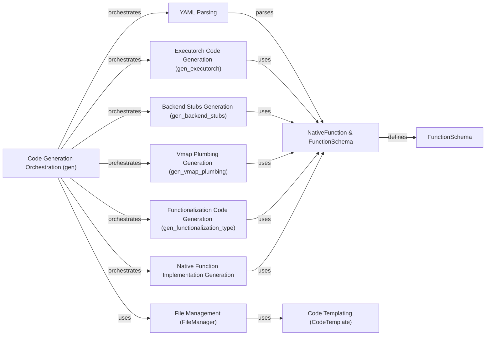

## Component Details

The `torchgen` component automates the generation of PyTorch code from declarative specifications, primarily targeting Core Tensor Operations and Neural Network Construction. It streamlines the creation of operator definitions, dispatch code, and documentation, reducing manual effort and ensuring consistency across the library. The process begins with parsing YAML files containing operator definitions, translating them into internal data structures like `NativeFunction` and `FunctionSchema`. These structures are then used by various code generation sub-components to generate code for different aspects of PyTorch, such as Executorch kernels, backend stubs, lazy tensors, vmap plumbing, and functionalization. The `FileManager` and `CodeTemplate` utilities facilitate the writing of generated code to files, while the central `gen` module orchestrates the entire process.

### YAML Parsing
This component is responsible for parsing YAML files that contain operator definitions and schemas. It serves as the initial step in the code generation pipeline, converting the declarative specifications into a structured format that can be processed by subsequent components.
- **Related Classes/Methods**: `pytorch.torchgen.gen:parse_native_yaml`, `pytorch.torchgen.gen:parse_native_yaml_struct`, `pytorch.torchgen.gen:parse_tags_yaml`, `pytorch.torchgen.gen:parse_tags_yaml_struct`

### NativeFunction & FunctionSchema
These components represent the core data structures used throughout the code generation process. `NativeFunction` encapsulates the schema, arguments, and other relevant information of a native function, while `FunctionSchema` defines the structure of a function, including its arguments and return types. They provide a structured representation of operator definitions that can be used by various code generation components.
- **Related Classes/Methods**: `pytorch.torchgen.model.NativeFunction:from_yaml`, `pytorch.torchgen.model.NativeFunction:__post_init__`, `pytorch.torchgen.model.FunctionSchema:parse`, `pytorch.torchgen.model.FunctionSchema:__post_init__`

### Code Generation Orchestration (gen)
This component acts as the central orchestrator of the code generation process. It coordinates the parsing of YAML files, the translation of data into internal representations, the generation of code for various targets, and the writing of files. It utilizes the `FileManager` to write files and orchestrates other components like `gen_executorch` and `gen_backend_stubs`.
- **Related Classes/Methods**: `pytorch.torchgen.gen:file_manager_from_dispatch_key`, `pytorch.torchgen.gen:parse_native_yaml_struct`, `pytorch.torchgen.gen:gen_headers`, `pytorch.torchgen.gen:gen_source_files`

### Executorch Code Generation (gen_executorch)
This component generates code specifically for Executorch kernels. It leverages the parsed operator definitions and schemas to produce optimized code for this execution environment.
- **Related Classes/Methods**: `pytorch.torchgen.gen_executorch:gen_unboxing`, `pytorch.torchgen.gen_executorch:compute_native_function_declaration`, `pytorch.torchgen.gen_executorch:gen_custom_ops`

### Backend Stubs Generation (gen_backend_stubs)
This component generates backend stubs, which are interface definitions for different backends to implement the operators. It ensures that the generated code is compatible with various hardware and software backends.
- **Related Classes/Methods**: `pytorch.torchgen.gen_backend_stubs:parse_backend_yaml`, `pytorch.torchgen.gen_backend_stubs:gen_dispatchkey_nativefunc_headers`, `pytorch.torchgen.gen_backend_stubs:gen_dispatcher_registrations`

### Vmap Plumbing Generation (gen_vmap_plumbing)
This component generates the vmap plumbing, which enables automatic vectorization of operators. It allows PyTorch to automatically apply operations to batches of data, improving performance.
- **Related Classes/Methods**: `pytorch.torchgen.gen_vmap_plumbing:gen_unwraps`, `pytorch.torchgen.gen_vmap_plumbing:gen_returns`, `pytorch.torchgen.gen_vmap_plumbing:gen_vmap_plumbing`

### Functionalization Code Generation (gen_functionalization_type)
This component generates code for functionalization, which transforms in-place operations into functional ones. It is important for enabling features like autograd and ensuring that operations do not have unintended side effects.
- **Related Classes/Methods**: `pytorch.torchgen.gen_functionalization_type:unwrap_tensor_args`, `pytorch.torchgen.gen_functionalization_type:emit_inplace_functionalization_body`, `pytorch.torchgen.gen_functionalization_type:gen_functionalization_definition`

### Native Function Implementation Generation
This component generates the actual implementations of native functions based on the parsed schemas and other specifications. It is responsible for creating the code that performs the operations defined in the YAML files.
- **Related Classes/Methods**: `pytorch.torchgen.native_function_generation:generate_out_args_from_schema`, `pytorch.torchgen.native_function_generation:generate_function`, `pytorch.torchgen.native_function_generation:gen_composite_functional_kernel`

### File Management (FileManager)
This component manages the writing of generated code to files, including template substitution and sharding. It provides a consistent and efficient way to write generated code to disk.
- **Related Classes/Methods**: `pytorch.torchgen.utils.FileManager:substitute_with_template`, `pytorch.torchgen.utils.FileManager:write_with_template`, `pytorch.torchgen.utils.FileManager:write_sharded`

### Code Templating (CodeTemplate)
This component represents a code template that can be used to generate code by substituting placeholders with actual values. It allows for the creation of reusable code patterns that can be customized for different operators and backends.
- **Related Classes/Methods**: `pytorch.torchgen.code_template.CodeTemplate:from_file`, `pytorch.torchgen.code_template.CodeTemplate:substitute`
