```mermaid
graph LR
    torch_onnx_utils_export["torch.onnx.utils:export"]
    torch_onnx_utils__trace["torch.onnx.utils:_trace"]
    torch_onnx_utils__model_to_graph["torch.onnx.utils:_model_to_graph"]
    torch_onnx_symbolic_opset9_and_other_opset_versions_["torch.onnx.symbolic_opset9 (and other opset versions)"]
    torch_onnx_utils__run_symbolic_method["torch.onnx.utils:_run_symbolic_method"]
    torch_onnx_utils__optimize_graph["torch.onnx.utils:_optimize_graph"]
    torch_onnx__type_utils_JitScalarType["torch.onnx._type_utils.JitScalarType"]
    torch_onnx_utils_export -- "Orchestrates" --> torch_onnx_utils__trace
    torch_onnx_utils_export -- "Uses" --> torch_onnx_utils__optimize_graph
    torch_onnx_utils_export -- "Traces model" --> torch_onnx_utils__model_to_graph
    torch_onnx_utils__trace -- "Converts model to graph" --> torch_onnx_utils__model_to_graph
    torch_onnx_utils__model_to_graph -- "Uses symbolic functions" --> torch_onnx_symbolic_opset9_and_other_opset_versions_
    torch_onnx_utils__model_to_graph -- "Executes symbolic functions" --> torch_onnx_utils__run_symbolic_method
    torch_onnx_symbolic_opset9_and_other_opset_versions_ -- "Converts PyTorch operators to ONNX" --> torch_onnx_utils__run_symbolic_method
    torch_onnx_utils__run_symbolic_method -- "Optimizes the ONNX graph" --> torch_onnx_utils__optimize_graph
    torch_onnx_symbolic_opset9_and_other_opset_versions_ -- "Uses scalar type utilities" --> torch_onnx__type_utils_JitScalarType
```

## Component Details

The Model Deployment & Optimization component focuses on converting PyTorch models into the ONNX format for deployment on various platforms. The primary flow involves tracing the PyTorch model's execution, converting PyTorch operators to their ONNX equivalents using symbolic functions, optimizing the resulting ONNX graph, and finally exporting the optimized graph. This process ensures interoperability and efficient execution of PyTorch models in diverse environments.

### torch.onnx.utils:export
The `export` function serves as the main entry point for converting a PyTorch model to the ONNX format. It orchestrates the entire process, including tracing the model's execution, converting operators using symbolic functions, optimizing the generated ONNX graph, and saving the final result. It takes the model, input data, and other export configurations as input.
- **Related Classes/Methods**: `torch.onnx.utils:export`

### torch.onnx.utils:_trace
The `_trace` function is responsible for tracing the execution of the PyTorch model. It runs the model with dummy inputs and records the operations performed during the forward pass. This tracing process captures the model's computational graph, which is then used for ONNX conversion.
- **Related Classes/Methods**: `torch.onnx.utils:_trace`, `torch.onnx.utils:_trace_and_get_graph_from_model`

### torch.onnx.utils:_model_to_graph
The `_model_to_graph` function converts a PyTorch model to a graph representation suitable for ONNX export. It sets up the tracing environment and calls the tracing function to obtain the computational graph of the model. This graph representation is then used for subsequent optimization and conversion steps.
- **Related Classes/Methods**: `torch.onnx.utils:_model_to_graph`

### torch.onnx.symbolic_opset9 (and other opset versions)
The `symbolic_opset` modules (e.g., `symbolic_opset9`, `symbolic_opset15`) contain the symbolic functions that define how PyTorch operators are converted to ONNX operators for different ONNX opset versions. Each symbolic function corresponds to a specific PyTorch operator and specifies the equivalent ONNX representation.
- **Related Classes/Methods**: `torch.onnx.symbolic_opset9`, `torch.onnx.symbolic_opset15`, `torch.onnx.symbolic_opset16`, `torch.onnx.symbolic_opset17`, `torch.onnx.symbolic_caffe2`

### torch.onnx.utils:_run_symbolic_method
The `_run_symbolic_method` function executes the symbolic function corresponding to a PyTorch operator. It takes the operator's inputs and attributes as arguments and calls the appropriate symbolic function to convert the operator to its ONNX representation. This function acts as a dispatcher, selecting the correct symbolic function based on the operator type and opset version.
- **Related Classes/Methods**: `torch.onnx.utils:_run_symbolic_method`, `torch.onnx.utils:_run_symbolic_function`

### torch.onnx.utils:_optimize_graph
The `_optimize_graph` function optimizes the ONNX graph to improve its performance. It applies various graph transformations, such as removing redundant nodes, fusing operations, and simplifying the graph structure. These optimizations can significantly reduce the size of the ONNX model and improve its inference speed.
- **Related Classes/Methods**: `torch.onnx.utils:_optimize_graph`

### torch.onnx._type_utils.JitScalarType
The `JitScalarType` class is a utility for handling scalar types during ONNX export. It provides methods for converting between PyTorch and ONNX scalar types, ensuring that the types are correctly represented in the ONNX graph.
- **Related Classes/Methods**: `torch.onnx._type_utils.JitScalarType`
