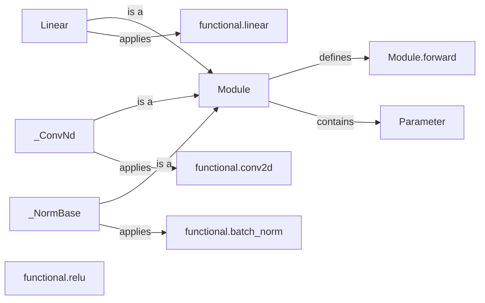

## Component Details

The Neural Network Construction component in PyTorch provides a modular and flexible way to define and build neural network architectures. It revolves around the `Module` class, which serves as the base for all neural network building blocks. Modules can contain other Modules, creating a hierarchical structure. Parameters, which are special Tensors, are automatically tracked when assigned as Module attributes. Pre-defined layers like Linear, Conv2D, and BatchNorm, along with activation functions from `torch.nn.functional`, are available for constructing complex networks. The `forward` method in each Module defines the computation performed when the Module is called, allowing for custom network behavior.

### Module
The base class for all neural network modules in PyTorch. It provides core functionalities such as registering parameters and buffers, managing submodules, and defining the forward pass. It serves as the foundation upon which all other neural network components are built.
- **Related Classes/Methods**: `torch.nn.modules.module.Module`

### Parameter
A Tensor subclass that represents a module parameter. Parameters are automatically registered as part of a Module when they are assigned as Module attributes. Parameters are key components of neural networks that are optimized during training.
- **Related Classes/Methods**: `torch.nn.parameter.Parameter`

### Linear
A module that applies a linear transformation to the input data: `y = xW^T + b`. It inherits from Module and contains a weight and bias Parameter. It uses the functional interface `linear` to perform the actual linear transformation.
- **Related Classes/Methods**: `torch.nn.modules.linear.Linear`

### _ConvNd
The base class for all convolutional modules in `torch.nn`. It provides the basic structure and functionality for defining convolutional layers with different dimensions (1D, 2D, 3D).
- **Related Classes/Methods**: `torch.nn.modules.conv._ConvNd`

### _NormBase
The base class for normalization layers like BatchNorm. It handles common normalization operations and provides a consistent interface for different normalization techniques.
- **Related Classes/Methods**: `torch.nn.modules.batchnorm._NormBase`

### functional.linear
The functional interface for applying a linear transformation. It takes the input, weight, and bias as arguments and returns the output of the linear transformation. It's used by the Linear module to perform the actual computation.
- **Related Classes/Methods**: `torch.nn.functional:linear`

### functional.conv2d
The functional interface for applying a 2D convolution. It takes the input, weight, and bias as arguments and returns the output of the convolution operation. It's used by the convolutional modules to perform the actual convolution.
- **Related Classes/Methods**: `torch.nn.functional:conv2d`

### functional.batch_norm
The functional interface for applying batch normalization. It takes the input, running mean, running variance, weight, and bias as arguments and returns the output of the batch normalization operation. It's used by the BatchNorm module to perform the actual normalization.
- **Related Classes/Methods**: `torch.nn.functional:batch_norm`

### functional.relu
The functional interface for applying the ReLU activation function. It takes the input as an argument and returns the output after applying the ReLU function. It's used as a common activation function in neural networks.
- **Related Classes/Methods**: `torch.nn.functional:relu`

### Module.forward
The method in Module that defines the computation performed at every call. Subclasses should override this method to implement the specific functionality of the module. It receives the input tensors and returns the output tensors.
- **Related Classes/Methods**: `torch.nn.modules.module.Module:forward`
