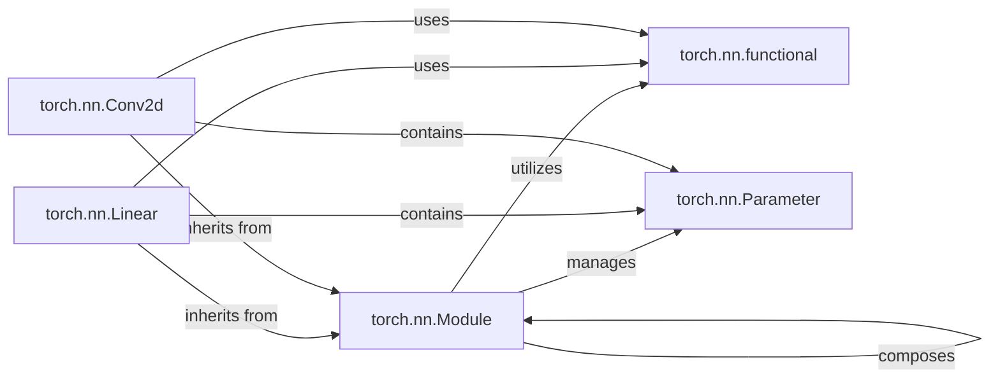

## Details

The `torch.nn` subsystem is the foundational building block for neural networks in PyTorch, centered around the abstract `Module` class. This class provides the essential framework for defining network layers, managing learnable `Parameter`s, and orchestrating the forward pass. Concrete modules like `Linear` and `Conv2d` inherit from `Module`, encapsulating specific operations and their associated parameters. The `functional` component offers stateless operations that can be used independently or within `Module` implementations, providing flexibility and reusability. This hierarchical structure, with `Module` as the base, enables modular and extensible neural network design.

### torch.nn.Module
The abstract base class for all neural network modules. It provides the core API for managing parameters, buffers, and child modules, defining the forward pass, and handling device placement (CPU/GPU). It is the cornerstone for building any neural network in PyTorch.

**Related Classes/Methods**:

- <a href="https://github.com/pytorch/pytorch/blob/main/torch/nn/modules/module.py" target="_blank" rel="noopener noreferrer">`torch.nn.Module`</a>

### torch.nn.functional
A collection of stateless, functional implementations of common neural network operations (e.g., activation functions like relu, pooling operations, convolution, linear transformations). These functions can be used directly on tensors and are often called internally by `nn.Module` subclasses.

**Related Classes/Methods**:

- <a href="https://github.com/pytorch/pytorch/blob/main/torch/nn/functional.py" target="_blank" rel="noopener noreferrer">`torch.nn.functional`</a>

### torch.nn.Parameter
A specialized `torch.Tensor` subclass that is automatically registered as a learnable parameter when assigned as an attribute to an `nn.Module`. It signals to the autograd engine that these tensors require gradients and should be included in the model's optimizable parameters.

**Related Classes/Methods**:

- <a href="https://github.com/pytorch/pytorch/blob/main/torch/nn/parameter.py" target="_blank" rel="noopener noreferrer">`torch.nn.Parameter`</a>

### torch.nn.Linear
A concrete implementation of a fully connected (linear) layer, inheriting from `torch.nn.Module`. It performs a linear transformation on the input data (y = xA^T + b), managing its own weight and bias parameters as `torch.nn.Parameter` instances.

**Related Classes/Methods**:

- <a href="https://github.com/pytorch/pytorch/blob/main/torch/nn/modules/linear.py" target="_blank" rel="noopener noreferrer">`torch.nn.Linear`</a>

### torch.nn.Conv2d
A concrete implementation of a 2D convolutional layer, inheriting from `torch.nn.Module`. It applies a 2D convolution operation over an input signal composed of several input planes, managing its own weight and bias parameters.

**Related Classes/Methods**:

- <a href="https://github.com/pytorch/pytorch/blob/main/torch/nn/modules/conv.py" target="_blank" rel="noopener noreferrer">`torch.nn.Conv2d`</a>

### [FAQ](https://github.com/CodeBoarding/GeneratedOnBoardings/tree/main?tab=readme-ov-file#faq)