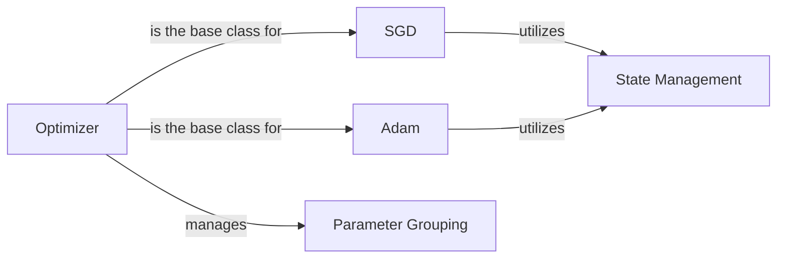

## Component Details

The `torch.optim` package provides a variety of optimization algorithms for training neural networks. These algorithms adjust the network's parameters based on the gradients computed during backpropagation, with the goal of minimizing a loss function. The core components include the base `Optimizer` class, specific optimization algorithms like `SGD` and `Adam`, mechanisms for managing optimizer state, and the ability to group parameters for fine-grained control over the optimization process. These components work together to efficiently update model parameters and achieve optimal performance.

### Optimizer
The `Optimizer` class serves as the base class for all optimization algorithms in PyTorch. It provides a common interface for adding parameters to be optimized, setting hyperparameters like learning rate and weight decay, and performing optimization steps. It also manages parameter groups, allowing different learning rates to be applied to different parts of the model.
- **Related Classes/Methods**: `torch.optim.optimizer`

### SGD
The `SGD` class implements the Stochastic Gradient Descent algorithm, a fundamental optimization technique. It updates parameters by moving them in the opposite direction of the gradient of the loss function. It supports features like momentum, weight decay, and dampening for improved convergence.
- **Related Classes/Methods**: `torch.optim.sgd.SGD`

### Adam
The `Adam` class implements the Adam (Adaptive Moment Estimation) algorithm, an adaptive learning rate optimization method. It combines the benefits of both momentum and RMSprop, adjusting the learning rate for each parameter based on estimates of the first and second moments of the gradients. This makes it suitable for a wide range of neural network architectures.
- **Related Classes/Methods**: `torch.optim.adam.Adam`

### Parameter Grouping
The `Parameter Grouping` mechanism allows users to specify different optimization options (e.g., learning rate, weight decay) for different subsets of model parameters. This is achieved by passing a list of dictionaries to the optimizer constructor, where each dictionary defines a parameter group and its corresponding hyperparameters. This enables fine-grained control over the optimization process.
- **Related Classes/Methods**: `torch.optim.optimizer`

### State Management
Optimization algorithms often maintain internal state, such as momentum buffers or moving average estimates of gradients. This state is updated during each optimization step and is crucial for the algorithm's behavior. The `Optimizer` class provides a mechanism for managing this state, ensuring that it is properly initialized, updated, and persisted.
- **Related Classes/Methods**: `torch.optim.optimizer`, `torch.optim.adam.Adam`, `torch.optim.sgd.SGD`
