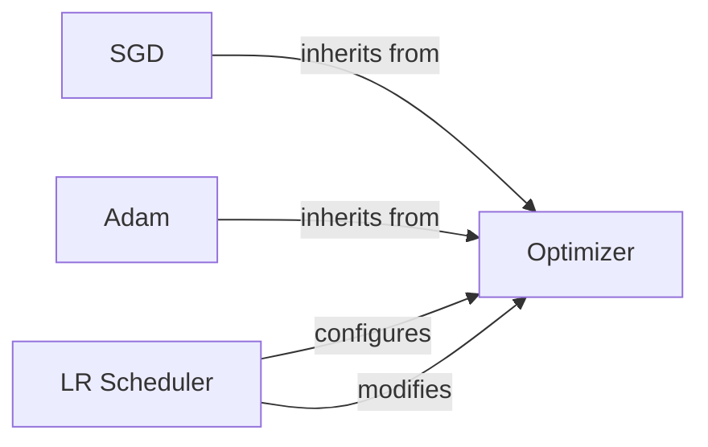

## Details

The `torch.optim` subsystem provides a robust framework for optimizing neural network models. At its core is the `Optimizer` abstract component, which defines the fundamental contract for all optimization algorithms. Specialized optimizers such as `SGD` and `Adam` extend this base, offering distinct strategies for updating model parameters. Complementing these optimizers, the `LR Scheduler` component dynamically adjusts the learning rate of an `Optimizer` throughout the training process, a critical mechanism for achieving optimal model convergence and performance. This modular design allows for flexible and powerful control over the training dynamics.

### Optimizer
This is the foundational abstract class for all optimization algorithms in PyTorch. It defines the common interface and core functionalities for managing model parameters, their associated optimization state (e.g., momentum buffers), and the overall optimization process. Concrete optimizers inherit from this class.

**Related Classes/Methods**:

- <a href="https://github.com/pytorch/pytorch/blob/main/torch/optim/optimizer.py#L338-L1153" target="_blank" rel="noopener noreferrer">`torch.optim.optimizer.Optimizer`:338-1153</a>

### SGD
A concrete implementation of the Stochastic Gradient Descent optimization algorithm. It supports various enhancements such as momentum, Nesterov momentum, and weight decay, making it a widely used optimizer in deep learning.

**Related Classes/Methods**:

- <a href="https://github.com/pytorch/pytorch/blob/main/torch/optim/sgd.py#L250-L317" target="_blank" rel="noopener noreferrer">`torch.optim.sgd.SGD`:250-317</a>

### Adam
A concrete implementation of the Adam optimization algorithm, an adaptive learning rate method that computes individual adaptive learning rates for different parameters from estimates of first and second moments of the gradients. It's known for its efficiency and good performance in many scenarios.

**Related Classes/Methods**:

- <a href="https://github.com/pytorch/pytorch/blob/main/torch/optim/adam.py#L885-L973" target="_blank" rel="noopener noreferrer">`torch.optim.adam.Adam`:885-973</a>

### LR Scheduler
This is the base class for all learning rate schedulers. It provides the core functionality for adjusting the learning rate of an optimizer based on the number of epochs. It interacts directly with the `Optimizer` to modify its learning rate.

**Related Classes/Methods**:

- <a href="https://github.com/pytorch/pytorch/blob/main/torch/optim/lr_scheduler.py#L82-L224" target="_blank" rel="noopener noreferrer">`torch.optim.lr_scheduler.LRScheduler`:82-224</a>

### [FAQ](https://github.com/CodeBoarding/GeneratedOnBoardings/tree/main?tab=readme-ov-file#faq)