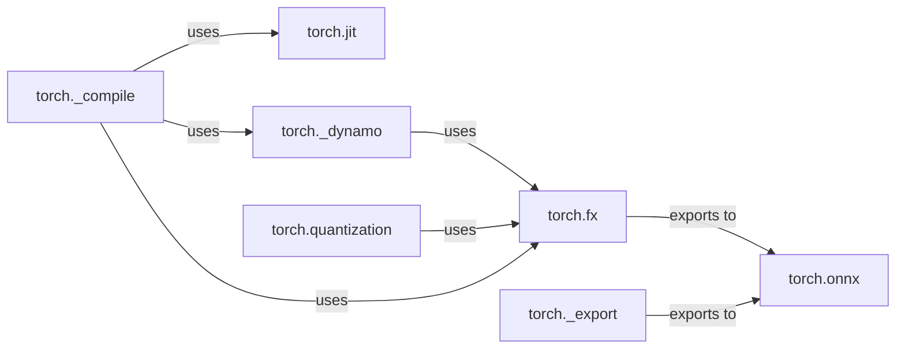

## Component Details

The Performance Optimization component in PyTorch focuses on enhancing the execution speed of models through various compilation techniques. It leverages Just-In-Time (JIT) compilation via `torch.jit` to convert eager-mode PyTorch code into TorchScript, enabling optimizations like graph fusion. Additionally, it employs Ahead-Of-Time (AOT) compilation using TorchDynamo (`torch._dynamo`) to dynamically rewrite Python bytecode into optimized kernels. These methods, along with tools like `torch.fx` for graph transformations and `torch.quantization` for model size reduction, contribute to improved performance across core tensor operations and neural network construction. The component also includes functionalities for exporting models to formats like ONNX (`torch.onnx` and `torch._export`) for deployment on diverse platforms.

### torch.jit
The `torch.jit` module provides tools for just-in-time (JIT) compilation of PyTorch models. It allows converting eager-mode PyTorch code into TorchScript, an intermediate representation that can be optimized and executed efficiently. It includes scripting and tracing functionalities.
- **Related Classes/Methods**: `pytorch.torch.jit._script`, `pytorch.torch.jit._trace`, `pytorch.torch.jit._fuser`

### torch._dynamo
TorchDynamo is a Python-to-Python AOT compiler designed to make unmodified PyTorch programs faster. It uses frame evaluation to intercept Python bytecode and dynamically rewrite PyTorch programs to use optimized kernels.
- **Related Classes/Methods**: `pytorch.torch._dynamo.convert_frame`, `pytorch.torch._dynamo.optimize`, `pytorch.torch._dynamo.aot_autograd`

### torch.fx
Torch.fx is a toolkit for developers to transform their PyTorch code. It defines a functional intermediate representation, which enables program transformations such as quantization, pruning, and graph optimization.
- **Related Classes/Methods**: `pytorch.torch.fx.experimental.optimization`, `pytorch.torch.fx.experimental.proxy_tensor`

### torch.onnx
The `torch.onnx` module facilitates exporting PyTorch models to the ONNX (Open Neural Network Exchange) format. This allows models trained in PyTorch to be deployed on a variety of platforms and runtimes that support ONNX.
- **Related Classes/Methods**: `pytorch.torch.onnx.utils`, `pytorch.torch.onnx`

### torch._export
The `torch._export` module provides a new export API for PyTorch models, designed to be more robust and flexible than the older `torch.onnx` exporter. It allows users to save and load exported models, as well as serialize and deserialize them.
- **Related Classes/Methods**: `pytorch.torch._export`, `pytorch.torch._export.serde.serialize`, `pytorch.torch._export.api.python`

### torch.quantization
The `torch.quantization` module provides tools for quantizing PyTorch models, which reduces their size and improves their performance, especially on hardware with limited resources. It includes functions for preparing and converting models for quantization using FX graph mode.
- **Related Classes/Methods**: `pytorch.torch.quantization.quantize_fx`

### torch._compile
The `torch._compile` module provides a high-level interface for compiling PyTorch models. It likely integrates with other compilation tools like TorchDynamo and TorchScript to optimize models for different execution environments.
- **Related Classes/Methods**: `pytorch.torch._compile`
