```mermaid
graph LR
    Tensor_Python_API["Tensor Python API"]
    Tensor_Core_C_Implementation["Tensor Core C++ Implementation"]
    Tensor_Operations_ATen_Library_["Tensor Operations (ATen Library)"]
    Tensor_Factories_Memory_Management["Tensor Factories & Memory Management"]
    Type_Device_Management["Type & Device Management"]
    Operation_Dispatcher["Operation Dispatcher"]
    Hardware_Specific_Backends["Hardware-Specific Backends"]
    Tensor_Python_API -- "delegates computations to" --> Tensor_Core_C_Implementation
    Tensor_Core_C_Implementation -- "provides backend for" --> Tensor_Python_API
    Tensor_Core_C_Implementation -- "executes operations from" --> Tensor_Operations_ATen_Library_
    Tensor_Core_C_Implementation -- "utilizes" --> Tensor_Factories_Memory_Management
    Tensor_Operations_ATen_Library_ -- "executed by" --> Tensor_Core_C_Implementation
    Tensor_Operations_ATen_Library_ -- "relies on" --> Type_Device_Management
    Tensor_Factories_Memory_Management -- "creates tensors for" --> Tensor_Core_C_Implementation
    Tensor_Factories_Memory_Management -- "manages memory for" --> Tensor_Core_C_Implementation
    Type_Device_Management -- "informs" --> Tensor_Core_C_Implementation
    Type_Device_Management -- "influences" --> Operation_Dispatcher
    Operation_Dispatcher -- "receives requests from" --> Tensor_Core_C_Implementation
    Operation_Dispatcher -- "routes to" --> Hardware_Specific_Backends
    Hardware_Specific_Backends -- "receives tasks from" --> Operation_Dispatcher
    Hardware_Specific_Backends -- "executes computations for" --> Tensor_Core_C_Implementation
```

## Details

The `Tensor Operations & Core` subsystem forms the foundational layer of PyTorch, defining the `Tensor` data structure and implementing all low-level mathematical operations. It encompasses the user-facing Python API for tensors, the underlying C++ implementation that manages data and executes operations, the mechanisms for creating and managing tensor memory, handling data types and device placement, and the dispatch system that routes operations to highly optimized hardware-specific backends. This subsystem is the bedrock upon which the entire computational graph and higher-level deep learning functionalities are built.

### Tensor Python API
Provides the high-level, user-friendly Python interface for tensor operations. It encapsulates the underlying C++ tensor data and metadata (shape, dtype, device) and serves as the primary interaction point for users to define and manipulate tensors.

**Related Classes/Methods**:

- <a href="https://github.com/pytorch/pytorch/blob/main/torch/_dynamo/variables/torch.py" target="_blank" rel="noopener noreferrer">`torch.Tensor`</a>

### Tensor Core C++ Implementation
The core engine that manages raw tensor data, performs efficient low-level mathematical operations, and interacts directly with hardware-specific backends. It handles memory allocation, deallocation, and the execution of primitive tensor operations.

**Related Classes/Methods**:

- <a href="https://github.com/pytorch/pytorch/blob/main/torch/csrc" target="_blank" rel="noopener noreferrer">`torch.csrc`</a>

### Tensor Operations (ATen Library)
A comprehensive collection of C++ functions and kernels that implement all fundamental mathematical operations on tensors, including element-wise operations, linear algebra routines, reduction operations (e.g., sum, mean), and indexing/slicing functionalities. It represents the vast array of computational primitives.

**Related Classes/Methods**:

- <a href="https://github.com/pytorch/pytorch/blob/main/torch/csrc" target="_blank" rel="noopener noreferrer">`torch.csrc`</a>

### Tensor Factories & Memory Management
Responsible for creating new `torch.Tensor` objects, allocating and deallocating memory efficiently, and managing the tensor data lifecycle across different computational devices (CPU, GPU). This component minimizes memory overhead and improves performance.

**Related Classes/Methods**:

- <a href="https://github.com/pytorch/pytorch/blob/main/torch/__init__.py" target="_blank" rel="noopener noreferrer">`torch.zeros`</a>
- <a href="https://github.com/pytorch/pytorch/blob/main/torch/__init__.py" target="_blank" rel="noopener noreferrer">`torch.ones`</a>
- <a href="https://github.com/pytorch/pytorch/blob/main/torch/__init__.py" target="_blank" rel="noopener noreferrer">`torch.empty`</a>
- <a href="https://github.com/pytorch/pytorch/blob/main/torch/_dynamo/variables/torch.py" target="_blank" rel="noopener noreferrer">`torch.tensor`</a>
- <a href="https://github.com/pytorch/pytorch/blob/main/torch/csrc" target="_blank" rel="noopener noreferrer">`torch.csrc`</a>

### Type & Device Management
Manages tensor properties such as data types (e.g., float32, int64, bool) and the placement of tensors on different computational devices (CPU, CUDA GPU, ROCm GPU, Intel XPU). It ensures type compatibility and correct device context for operations.

**Related Classes/Methods**:

- <a href="https://github.com/pytorch/pytorch/blob/main/torch/_dynamo/variables/torch.py" target="_blank" rel="noopener noreferrer">`torch.dtype`</a>
- <a href="https://github.com/pytorch/pytorch/blob/main/torch/_dynamo/variables/torch.py" target="_blank" rel="noopener noreferrer">`torch.device`</a>
- <a href="https://github.com/pytorch/pytorch/blob/main/torch/csrc/Device.cpp" target="_blank" rel="noopener noreferrer">`torch.csrc`</a>

### Operation Dispatcher
A crucial routing mechanism that directs tensor operations to the appropriate hardware-specific kernel (CPU, CUDA, ROCm, XPU) based on the tensor's device, data type, and available optimizations. It provides a flexible and extensible way to add new hardware support.

**Related Classes/Methods**:

- <a href="https://github.com/pytorch/pytorch/blob/main/torch/csrc" target="_blank" rel="noopener noreferrer">`torch.csrc`</a>

### Hardware-Specific Backends
Optimized libraries and kernels (e.g., cuDNN for NVIDIA GPUs, MKL for CPUs, ROCm libraries for AMD GPUs) that perform the actual high-performance computations on various hardware accelerators. These backends abstract away hardware-specific programming details.

**Related Classes/Methods**:

- <a href="https://github.com/pytorch/pytorch/blob/main/torch/backends/cuda/__init__.py" target="_blank" rel="noopener noreferrer">`cuDNN`</a>
- <a href="https://github.com/pytorch/pytorch/blob/main/torch/_meta_registrations.py" target="_blank" rel="noopener noreferrer">`MKL`</a>

### [FAQ](https://github.com/CodeBoarding/GeneratedOnBoardings/tree/main?tab=readme-ov-file#faq)