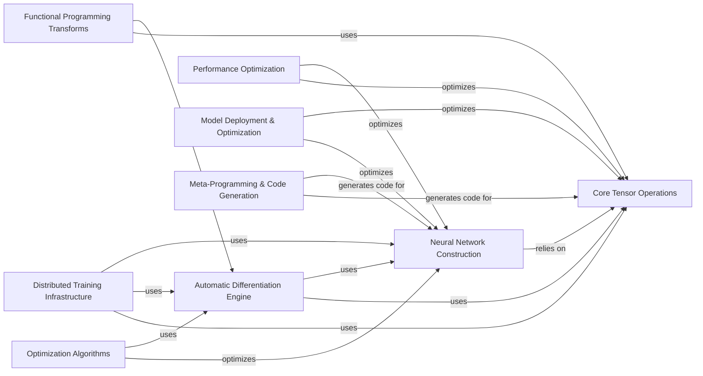

## Component Details

PyTorch is a comprehensive deep learning framework that provides a flexible and efficient platform for research and production. The framework revolves around tensor operations, automatic differentiation, and neural network construction, with additional features for optimization, compilation, distributed training, and model deployment. These components work together to enable users to define, train, and deploy complex deep learning models.

### Core Tensor Operations
This component encompasses the fundamental data structure, `torch.Tensor`, and its associated operations. It manages memory allocation, data type conversions, and basic arithmetic and manipulation functions. It forms the bedrock upon which all other components are built, providing the essential building blocks for numerical computation in PyTorch.
- **Related Classes/Methods**: `pytorch.torch._tensor`, `pytorch.torch.storage`

### Neural Network Construction
This component provides a high-level interface for building neural networks through the `torch.nn` module. It offers pre-defined layers (linear, convolutional, recurrent), activation functions, and loss functions, enabling users to easily assemble complex network architectures. It relies on the Core Tensor Operations component for its underlying computations.
- **Related Classes/Methods**: `pytorch.torch.nn.modules.module`, `pytorch.torch.nn.modules.linear`, `pytorch.torch.nn.modules.conv`, `pytorch.torch.nn.modules.batchnorm`, `pytorch.torch.nn.functional`

### Automatic Differentiation Engine
The `torch.autograd` component automatically computes gradients for tensor operations, enabling efficient training of neural networks. It constructs a dynamic computational graph that tracks operations performed on tensors, allowing for backpropagation to calculate gradients. It is essential for training neural networks and relies on both Core Tensor Operations and Neural Network Construction.
- **Related Classes/Methods**: `pytorch.torch.autograd.function`, `pytorch.torch.autograd.graph`, `pytorch.torch.autograd.gradcheck`, `pytorch.torch.autograd.functional`

### Optimization Algorithms
This component, found in `torch.optim`, implements various optimization algorithms such as SGD, Adam, and RMSprop. These algorithms update the parameters of neural networks based on gradients computed by the Automatic Differentiation Engine, aiming to minimize the loss function. It is a crucial part of the training process and directly interacts with Neural Network Construction to update model parameters.
- **Related Classes/Methods**: `pytorch.torch.optim.optimizer`, `pytorch.torch.optim.sgd`, `pytorch.torch.optim.adam`

### Performance Optimization
This component focuses on optimizing the performance of PyTorch models through Just-In-Time (JIT) compilation (`torch.jit`) and Ahead-Of-Time (AOT) compilation via TorchDynamo (`torch._dynamo`). It transforms Python code into more efficient representations, enabling optimizations like graph fusion and kernel specialization. It enhances the performance of both Core Tensor Operations and Neural Network Construction.
- **Related Classes/Methods**: `pytorch.torch.jit._script`, `pytorch.torch.jit._trace`, `pytorch.torch.jit._fuser`, `pytorch.torch._dynamo`, `pytorch.torch._dynamo.convert_frame`

### Distributed Training Infrastructure
The `torch.distributed` component enables training neural networks across multiple devices or machines, facilitating larger models and faster training times. It provides functionalities for data parallelism, model parallelism, and communication primitives for synchronizing gradients and data across processes. It leverages Core Tensor Operations, Automatic Differentiation Engine, and Neural Network Construction for distributed computations.
- **Related Classes/Methods**: `pytorch.torch.distributed.distributed_c10d`, `pytorch.torch.nn.parallel.distributed`, `pytorch.torch.distributed.fsdp`

### Model Deployment & Optimization
This component focuses on optimizing and deploying PyTorch models. It includes tools for quantizing neural networks (`torch.ao`) to reduce their size and improve inference speed, as well as functionalities for exporting models to the ONNX format (`torch.onnx`) for interoperability with other frameworks and hardware platforms. It optimizes Neural Network Construction and Core Tensor Operations for deployment scenarios.
- **Related Classes/Methods**: `pytorch.torch.ao.quantization`, `pytorch.torch.ao.nn.quantized`, `pytorch.torch.ao.nn.qat`, `pytorch.torch.onnx`, `pytorch.torch.onnx.utils`

### Meta-Programming & Code Generation
The `torchgen` component automates the generation of PyTorch code from declarative specifications. It streamlines the creation of operator definitions, dispatch code, and documentation, reducing manual effort and ensuring consistency across the library. It primarily generates code for Core Tensor Operations and Neural Network Construction.
- **Related Classes/Methods**: `pytorch.torchgen`, `pytorch.torchgen.gen`

### Functional Programming Transforms
Functorch (`pytorch.functorch`) provides composable function transforms for PyTorch, enabling features like vectorization, automatic differentiation, and stateless functions. It allows users to write more flexible and composable code for machine learning research, extending the capabilities of Core Tensor Operations and Automatic Differentiation Engine.
- **Related Classes/Methods**: `pytorch.functorch`, `pytorch.torch._functorch`