```mermaid
graph LR
    Tensor_Operations_Core["Tensor Operations & Core"]
    Automatic_Differentiation_Autograd_Engine_["Automatic Differentiation (Autograd Engine)"]
    Neural_Network_Modules_torch_nn_["Neural Network Modules (torch.nn)"]
    Optimizers_torch_optim_["Optimizers (torch.optim)"]
    Data_Utilities_torch_utils_data_["Data Utilities (torch.utils.data)"]
    JIT_Compiler_Scripting_TorchScript_["JIT Compiler & Scripting (TorchScript)"]
    Hardware_Backends["Hardware Backends"]
    Data_Utilities_torch_utils_data_ -- "provides data to" --> Tensor_Operations_Core
    Tensor_Operations_Core -- "provides primitives for" --> Neural_Network_Modules_torch_nn_
    Tensor_Operations_Core -- "leverages" --> Hardware_Backends
    Neural_Network_Modules_torch_nn_ -- "performs operations on" --> Tensor_Operations_Core
    Neural_Network_Modules_torch_nn_ -- "operations recorded by" --> Automatic_Differentiation_Autograd_Engine_
    Neural_Network_Modules_torch_nn_ -- "exported to" --> JIT_Compiler_Scripting_TorchScript_
    Automatic_Differentiation_Autograd_Engine_ -- "computes gradients for" --> Optimizers_torch_optim_
    Optimizers_torch_optim_ -- "updates parameters of" --> Neural_Network_Modules_torch_nn_
    Hardware_Backends -- "executes computations for" --> Tensor_Operations_Core
    click Tensor_Operations_Core href "https://github.com/CodeBoarding/GeneratedOnBoardings/blob/main/pytorch/Tensor_Operations_Core.md" "Details"
    click Automatic_Differentiation_Autograd_Engine_ href "https://github.com/CodeBoarding/GeneratedOnBoardings/blob/main/pytorch/Automatic_Differentiation_Autograd_Engine_.md" "Details"
    click Neural_Network_Modules_torch_nn_ href "https://github.com/CodeBoarding/GeneratedOnBoardings/blob/main/pytorch/Neural_Network_Modules_torch_nn_.md" "Details"
    click Optimizers_torch_optim_ href "https://github.com/CodeBoarding/GeneratedOnBoardings/blob/main/pytorch/Optimizers_torch_optim_.md" "Details"
    click Data_Utilities_torch_utils_data_ href "https://github.com/CodeBoarding/GeneratedOnBoardings/blob/main/pytorch/Data_Utilities_torch_utils_data_.md" "Details"
    click JIT_Compiler_Scripting_TorchScript_ href "https://github.com/CodeBoarding/GeneratedOnBoardings/blob/main/pytorch/JIT_Compiler_Scripting_TorchScript_.md" "Details"
    click Hardware_Backends href "https://github.com/CodeBoarding/GeneratedOnBoardings/blob/main/pytorch/Hardware_Backends.md" "Details"
```

## Details

PyTorch's architecture is fundamentally built around a dynamic computational graph, enabling an imperative and flexible approach to deep learning. At its core, the Tensor Operations & Core component provides the fundamental data structures and low-level mathematical operations, which are efficiently accelerated by various Hardware Backends. Data is prepared and loaded via Data Utilities before being processed by these tensors. Neural Network Modules leverage these core tensor operations to define model architectures, with every operation automatically tracked by the Automatic Differentiation (Autograd Engine). This engine is crucial for computing gradients, which are then used by Optimizers to update model parameters during training. For deployment, trained models from Neural Network Modules can be compiled and optimized into a static graph representation using the JIT Compiler & Scripting (TorchScript), facilitating efficient inference in production environments. This modular design emphasizes clear data flow and dynamic graph construction, making it highly suitable for research and rapid development.

### Tensor Operations & Core [[Expand]](./Tensor_Operations_Core.md)
The foundational component defining the `Tensor` data structure and implementing low-level mathematical operations. This is the bedrock upon which the computational graph is built.

**Related Classes/Methods**:

- <a href="https://github.com/pytorch/pytorch/blob/main/torch/_dynamo/variables/torch.py" target="_blank" rel="noopener noreferrer">`torch.tensor`</a>
- <a href="https://github.com/pytorch/pytorch/blob/main/torch/csrc/" target="_blank" rel="noopener noreferrer">`torch.csrc`</a>

### Automatic Differentiation (Autograd Engine) [[Expand]](./Automatic_Differentiation_Autograd_Engine_.md)
The core engine that records operations on tensors to build a dynamic computational graph and automatically computes gradients during the backward pass.

**Related Classes/Methods**:

- <a href="https://github.com/pytorch/pytorch/blob/main/torch/autograd/function.py" target="_blank" rel="noopener noreferrer">`torch.autograd.function`</a>
- <a href="https://github.com/pytorch/pytorch/blob/main/torch/autograd/__init__.py" target="_blank" rel="noopener noreferrer">`torch.autograd`</a>

### Neural Network Modules (torch.nn) [[Expand]](./Neural_Network_Modules_torch_nn_.md)
Provides high-level building blocks for neural networks, including layers, activation functions, and loss functions. These modules encapsulate operations and their parameters.

**Related Classes/Methods**:

- <a href="https://github.com/pytorch/pytorch/blob/main/torch/nn/modules/module.py" target="_blank" rel="noopener noreferrer">`torch.nn.modules.module`</a>
- <a href="https://github.com/pytorch/pytorch/blob/main/torch/nn/modules/linear.py" target="_blank" rel="noopener noreferrer">`torch.nn.modules.linear`</a>
- <a href="https://github.com/pytorch/pytorch/blob/main/torch/nn/modules/conv.py" target="_blank" rel="noopener noreferrer">`torch.nn.modules.conv`</a>
- <a href="https://github.com/pytorch/pytorch/blob/main/torch/nn/functional.py" target="_blank" rel="noopener noreferrer">`torch.nn.functional`</a>

### Optimizers (torch.optim) [[Expand]](./Optimizers_torch_optim_.md)
Implements various optimization algorithms (e.g., SGD, Adam) used to update the parameters of neural network models based on computed gradients.

**Related Classes/Methods**:

- <a href="https://github.com/pytorch/pytorch/blob/main/torch/optim/__init__.py" target="_blank" rel="noopener noreferrer">`torch.optim`</a>
- <a href="https://github.com/pytorch/pytorch/blob/main/torch/optim/sgd.py" target="_blank" rel="noopener noreferrer">`torch.optim.sgd`</a>
- <a href="https://github.com/pytorch/pytorch/blob/main/torch/optim/adam.py" target="_blank" rel="noopener noreferrer">`torch.optim.adam`</a>

### Data Utilities (torch.utils.data) [[Expand]](./Data_Utilities_torch_utils_data_.md)
Provides tools and abstractions for efficient data loading, preprocessing, and batching, enabling seamless integration with training pipelines.

**Related Classes/Methods**:

- <a href="https://github.com/pytorch/pytorch/blob/main/torch/utils/data/dataset.py" target="_blank" rel="noopener noreferrer">`torch.utils.data.dataset`</a>
- <a href="https://github.com/pytorch/pytorch/blob/main/torch/utils/data/dataloader.py" target="_blank" rel="noopener noreferrer">`torch.utils.data.dataloader`</a>

### JIT Compiler & Scripting (TorchScript) [[Expand]](./JIT_Compiler_Scripting_TorchScript_.md)
Enables tracing and scripting of models to create a static graph representation, facilitating model optimization, serialization, and deployment in production environments.

**Related Classes/Methods**:

- <a href="https://github.com/pytorch/pytorch/blob/main/torch/jit/__init__.py" target="_blank" rel="noopener noreferrer">`torch.jit`</a>

### Hardware Backends [[Expand]](./Hardware_Backends.md)
An abstraction layer that interfaces with different hardware accelerators (e.g., NVIDIA GPUs via CUDA, AMD GPUs via ROCm, Intel GPUs via XPU) to offload computations and achieve high performance.

**Related Classes/Methods**:

- <a href="https://github.com/pytorch/pytorch/blob/main/torch/cuda/__init__.py" target="_blank" rel="noopener noreferrer">`torch.cuda`</a>
- <a href="https://github.com/pytorch/pytorch/blob/main/torch/csrc/cuda/" target="_blank" rel="noopener noreferrer">`torch.csrc.cuda`</a>

### [FAQ](https://github.com/CodeBoarding/GeneratedOnBoardings/tree/main?tab=readme-ov-file#faq)