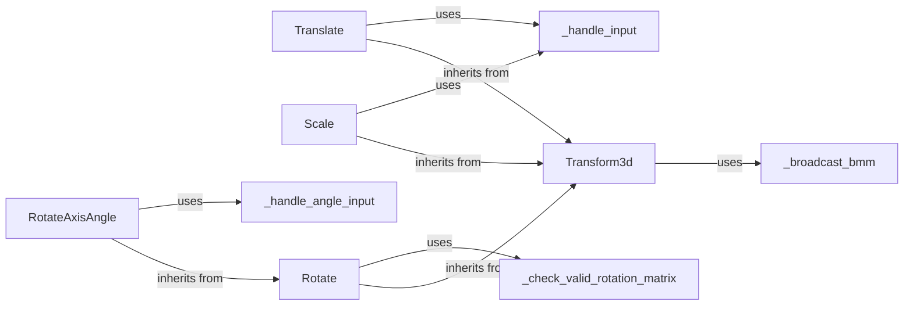

## Component Details

### Transform3d
The `Transform3d` class represents a batch of 3D transformations using a 4x4 matrix. It provides methods for composing transformations, transforming points and normals, and inverting transformations. It serves as a base class for more specific transformations like translation, scaling, and rotation, and supports broadcasting for efficient batch operations.
- **Related Classes/Methods**: `pytorch3d.transforms.transform3d.Transform3d`

### Translate
The `Translate` class, a subclass of `Transform3d`, represents a translation transformation. It allows specifying the translation vector and provides an efficient method for inverting the transformation. It uses the `_handle_input` helper function to ensure the input translation vector is a tensor of the correct shape.
- **Related Classes/Methods**: `pytorch3d.transforms.transform3d.Translate`

### Scale
The `Scale` class, a subclass of `Transform3d`, represents a scaling transformation. It allows specifying scaling factors along each coordinate axis and provides an efficient method for inverting the transformation. It uses the `_handle_input` helper function to ensure the input scale vector is a tensor of the correct shape.
- **Related Classes/Methods**: `pytorch3d.transforms.transform3d.Scale`

### Rotate
The `Rotate` class, a subclass of `Transform3d`, represents a rotation transformation. It takes a rotation matrix as input and provides an efficient method for inverting the transformation. It uses the `_check_valid_rotation_matrix` helper function to validate the input rotation matrix.
- **Related Classes/Methods**: `pytorch3d.transforms.transform3d.Rotate`

### RotateAxisAngle
The `RotateAxisAngle` class, a subclass of `Rotate`, represents a rotation transformation defined by an angle and an axis. It converts the angle and axis to a rotation matrix and then uses the Rotate class to perform the transformation. It uses the `_handle_angle_input` helper function for angle parsing.
- **Related Classes/Methods**: `pytorch3d.transforms.transform3d.RotateAxisAngle`

### _handle_input
The `_handle_input` helper function is used by `Translate` and `Scale` to handle parsing logic for building transforms. It ensures that the input is a tensor of shape (N, 3).
- **Related Classes/Methods**: `pytorch3d.transforms.transform3d._handle_input`

### _handle_angle_input
The `_handle_angle_input` helper function is used for building a rotation function using angles. The output is always of shape (N,).
- **Related Classes/Methods**: `pytorch3d.transforms.transform3d._handle_angle_input`

### _broadcast_bmm
The `_broadcast_bmm` helper function is used to batch multiply two matrices and broadcast if necessary. This is used within the Transform3d class.
- **Related Classes/Methods**: `pytorch3d.transforms.transform3d._broadcast_bmm`

### _check_valid_rotation_matrix
The `_check_valid_rotation_matrix` helper function is used to determine if a matrix is a valid rotation matrix. This is used within the Rotate class.
- **Related Classes/Methods**: `pytorch3d.transforms.transform3d._check_valid_rotation_matrix`
