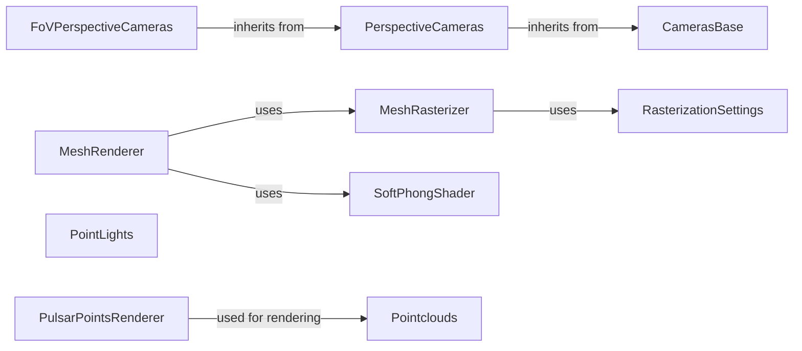

## Component Details

### CamerasBase
Abstract base class for all camera models, providing common functionalities like transforming points between world and camera coordinates. It defines abstract methods for projection and unprojection, which are implemented by concrete camera models.
- **Related Classes/Methods**: `pytorch3d.renderer.cameras.CamerasBase`

### PerspectiveCameras
A camera model that projects 3D points into a 2D image plane using perspective projection. It defines the camera's intrinsic and extrinsic parameters and implements the `get_projection_transform` and `unproject_points` methods.
- **Related Classes/Methods**: `pytorch3d.renderer.cameras.PerspectiveCameras`

### FoVPerspectiveCameras
A specialization of PerspectiveCameras that uses field-of-view (FoV) to define the camera's intrinsic parameters. It provides methods for converting between FoV and focal length.
- **Related Classes/Methods**: `pytorch3d.renderer.cameras.FoVPerspectiveCameras`

### MeshRenderer
A renderer that takes a mesh as input and produces a rendered image. It orchestrates the rendering process by combining a rasterizer and a shader.
- **Related Classes/Methods**: `pytorch3d.renderer.mesh.renderer.MeshRenderer`

### MeshRasterizer
A rasterizer that converts a mesh into a set of fragments (pixels) that are visible from the camera. It determines visibility and calculates depth.
- **Related Classes/Methods**: `pytorch3d.renderer.mesh.rasterizer.MeshRasterizer`

### RasterizationSettings
A data structure that holds the settings for the rasterization process, such as image size and blur radius.
- **Related Classes/Methods**: `pytorch3d.renderer.mesh.rasterizer.RasterizationSettings`

### SoftPhongShader
A shader that implements the Phong shading model with soft blending for antialiasing. It calculates the color of each fragment based on lighting and material properties.
- **Related Classes/Methods**: `pytorch3d.renderer.mesh.shader.SoftPhongShader`

### PointLights
A lighting model that represents point light sources in the scene, defining their position, color, and intensity.
- **Related Classes/Methods**: `pytorch3d.renderer.lighting.PointLights`

### Pointclouds
A data structure for representing point clouds, storing the coordinates and features of each point.
- **Related Classes/Methods**: `pytorch3d.structures.pointclouds.Pointclouds`

### PulsarPointsRenderer
A renderer for point clouds using the Pulsar algorithm, converting PyTorch3D data structures to Pulsar data structures and invoking the Pulsar renderer.
- **Related Classes/Methods**: `pytorch3d.renderer.points.pulsar.unified.PulsarPointsRenderer`
