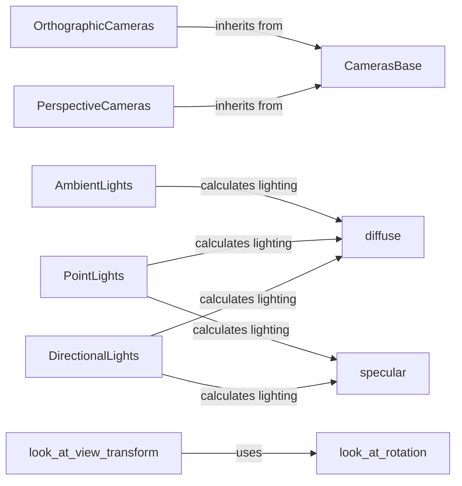

## Component Details

The Camera and Lighting Models component in PyTorch3D provides a set of tools for simulating realistic 3D scenes. It includes various camera models like perspective, orthographic, and fisheye, which define how 3D points are projected onto a 2D image plane. Additionally, it offers lighting models such as directional, point, and ambient lights, enabling the computation of light intensity and color at different points in the scene. These models are crucial for rendering 3D objects from different viewpoints and creating visually appealing simulations.

### CamerasBase
CamerasBase is an abstract base class that defines the interface for all camera models. It provides common functionalities such as transforming 3D points between world, view, and screen coordinates. Concrete camera models inherit from this class and implement specific projection methods.
- **Related Classes/Methods**: `pytorch3d.renderer.cameras.CamerasBase`

### PerspectiveCameras
PerspectiveCameras is a concrete camera model that implements perspective projection. It inherits from CamerasBase and provides methods for projecting 3D points onto a 2D plane using perspective projection, simulating how objects appear smaller as they move further away.
- **Related Classes/Methods**: `pytorch3d.renderer.cameras.PerspectiveCameras`

### OrthographicCameras
OrthographicCameras is a concrete camera model that implements orthographic projection. It inherits from CamerasBase and provides methods for projecting 3D points onto a 2D plane using orthographic projection, where objects maintain the same size regardless of their distance.
- **Related Classes/Methods**: `pytorch3d.renderer.cameras.OrthographicCameras`

### DirectionalLights
DirectionalLights is a lighting model that represents lights that emit parallel rays, like sunlight. It provides methods for calculating diffuse and specular lighting components based on the direction of the light source.
- **Related Classes/Methods**: `pytorch3d.renderer.lighting.DirectionalLights`

### PointLights
PointLights is a lighting model that represents lights that emit rays from a single point, like a light bulb. It provides methods for calculating diffuse and specular lighting components based on the position of the light source.
- **Related Classes/Methods**: `pytorch3d.renderer.lighting.PointLights`

### AmbientLights
AmbientLights is a lighting model that represents a uniform light intensity that affects all surfaces equally. It provides methods for calculating diffuse lighting components, simulating the effect of indirect lighting.
- **Related Classes/Methods**: `pytorch3d.renderer.lighting.AmbientLights`

### diffuse
The diffuse function calculates the diffuse lighting component, which represents the light scattered evenly in all directions from a surface. It depends on the angle between the light source and the surface normal.
- **Related Classes/Methods**: `pytorch3d.renderer.lighting`

### specular
The specular function calculates the specular lighting component, which represents the bright highlight on a surface caused by the reflection of light. It depends on the angle between the light source, the surface normal, and the viewer.
- **Related Classes/Methods**: `pytorch3d.renderer.lighting`

### look_at_view_transform
The look_at_view_transform function calculates the view transformation matrix that positions the camera to look at a specific target point in the scene. It takes the camera position, target point, and up direction as input.
- **Related Classes/Methods**: `pytorch3d.renderer.cameras`
