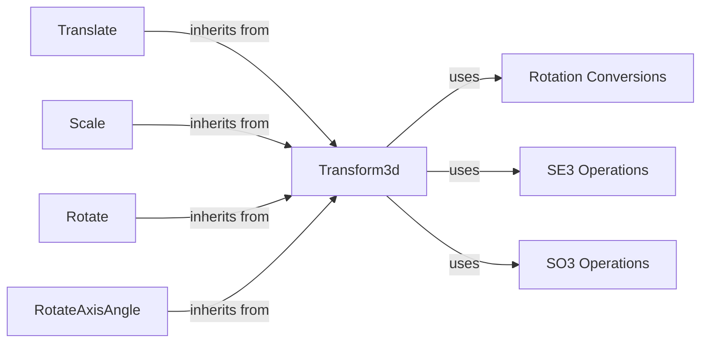

## Component Details

The Coordinate Transformations component in PyTorch3D provides a comprehensive suite of tools for manipulating 3D data. At its core is the Transform3d class, which serves as a base for various transformations like rotations, translations, and scaling. The library offers functionalities to convert between different rotation representations (rotation matrices, quaternions, Euler angles, axis-angle), enabling flexible manipulation of orientations. SE3 and SO3 operations provide advanced tools for rigid body transformations and rotations using Lie algebra representations. These components work together to facilitate complex 3D scene manipulation, model alignment, and coordinate system conversions, essential for various computer vision and graphics applications.

### Transform3d
The `Transform3d` class is a central component that represents a 3D transformation. It can be initialized with a transformation matrix or created from other transformations like rotations, translations, and scaling. It provides methods for composing transformations, applying them to points and normals, and inverting them. It serves as a base class for other specific transformations.
- **Related Classes/Methods**: `pytorch3d.transforms.transform3d.Transform3d`

### Rotation Conversions
This module provides functions for converting between different representations of rotations, including rotation matrices, quaternions, Euler angles, and axis-angle representations. These conversions are essential for manipulating rotations in different forms and for interoperability with other libraries. It allows to convert from one representation to another.
- **Related Classes/Methods**: `pytorch3d.transforms.rotation_conversions.matrix_to_quaternion`, `pytorch3d.transforms.rotation_conversions.euler_angles_to_matrix`, `pytorch3d.transforms.rotation_conversions.matrix_to_euler_angles`, `pytorch3d.transforms.rotation_conversions.axis_angle_to_matrix`, `pytorch3d.transforms.rotation_conversions.matrix_to_axis_angle`

### SE3 Operations
This module provides functions for working with SE3 transformations, which represent rigid body motions (rotations and translations) in 3D space. It includes functions for converting between SE3 transformations and their Lie algebra representations (se3_log_map, se3_exp_map).
- **Related Classes/Methods**: `pytorch3d.transforms.se3.se3_exp_map`, `pytorch3d.transforms.se3.se3_log_map`

### SO3 Operations
This module provides functions for working with SO3 transformations, which represent rotations in 3D space. It includes functions for converting between SO3 transformations and their Lie algebra representations (so3_log_map, so3_exp_map).
- **Related Classes/Methods**: `pytorch3d.transforms.so3.so3_exp_map`, `pytorch3d.transforms.so3.so3_log_map`

### Translate
The `Translate` class represents a translation transformation. It inherits from `Transform3d` and allows for specifying translations along the x, y, and z axes.
- **Related Classes/Methods**: `pytorch3d.transforms.transform3d.Translate`

### Scale
The `Scale` class represents a scaling transformation. It inherits from `Transform3d` and allows for scaling objects along the x, y, and z axes.
- **Related Classes/Methods**: `pytorch3d.transforms.transform3d.Scale`

### Rotate
The `Rotate` class represents a rotation transformation defined by a rotation matrix. It inherits from `Transform3d`.
- **Related Classes/Methods**: `pytorch3d.transforms.transform3d.Rotate`

### RotateAxisAngle
The `RotateAxisAngle` class represents a rotation transformation defined by an axis and an angle. It inherits from `Transform3d`.
- **Related Classes/Methods**: `pytorch3d.transforms.transform3d.RotateAxisAngle`
