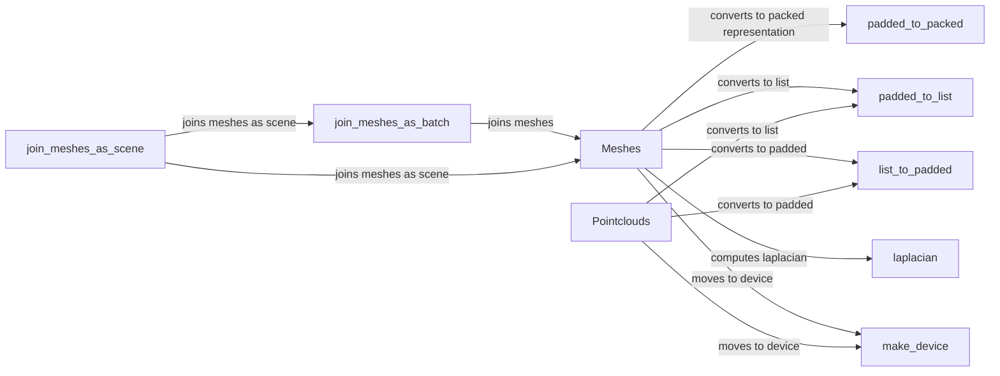

## Component Details

### Meshes
The Meshes class is a core data structure for representing and manipulating batches of 3D meshes. It stores mesh data such as vertices, faces, and texture coordinates, and provides methods for accessing, modifying, and operating on this data. It supports different data representations, including padded tensors, packed tensors, and lists of tensors, enabling efficient processing of meshes with varying sizes and topologies.
- **Related Classes/Methods**: `pytorch3d.structures.meshes.Meshes`

### Pointclouds
The Pointclouds class is a core data structure for representing and manipulating batches of 3D point clouds. It stores point cloud data such as points, normals, and features, and provides methods for accessing, modifying, and operating on this data. Similar to Meshes, it supports different data representations for efficient processing.
- **Related Classes/Methods**: `pytorch3d.structures.pointclouds.Pointclouds`

### padded_to_packed
This utility function converts padded tensors, which are often used to represent batches of meshes or point clouds with varying sizes, into packed tensors. Packed tensors store the data contiguously in memory, which can improve memory efficiency and performance for certain operations.
- **Related Classes/Methods**: `pytorch3d.structures.utils.padded_to_packed`

### padded_to_list
This utility function converts padded tensors into lists of tensors. This representation can be useful for operations that require processing individual meshes or point clouds separately.
- **Related Classes/Methods**: `pytorch3d.structures.utils.padded_to_list`

### list_to_padded
This utility function converts lists of tensors into padded tensors. This is the inverse operation of padded_to_list and is used to convert back to a padded representation after processing individual meshes or point clouds.
- **Related Classes/Methods**: `pytorch3d.structures.utils.list_to_padded`

### laplacian
This function computes the Laplacian matrix of a mesh. The Laplacian matrix is a fundamental tool in geometry processing and is used for various tasks such as mesh smoothing, deformation, and spectral analysis.
- **Related Classes/Methods**: `pytorch3d.ops.laplacian_matrices.laplacian`

### make_device
This utility function creates a torch device object, which specifies the device (CPU or GPU) on which tensors and operations should be executed. It simplifies the process of managing device placement and ensures that computations are performed on the appropriate hardware.
- **Related Classes/Methods**: `pytorch3d.common.datatypes.make_device`

### join_meshes_as_batch
This function takes a list of Meshes objects and joins them into a single Meshes object, treating each mesh as a separate element in a batch. This is useful for processing multiple meshes simultaneously.
- **Related Classes/Methods**: `pytorch3d.structures.meshes.join_meshes_as_batch`

### join_meshes_as_scene
This function takes a list of Meshes objects and joins them into a single Meshes object, treating them as a single scene. This is useful when the meshes represent different parts of a single object or environment.
- **Related Classes/Methods**: `pytorch3d.structures.meshes.join_meshes_as_scene`
