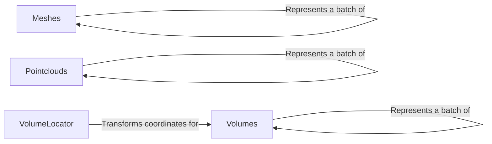

## Component Details

The Data Structures component in PyTorch3D provides the fundamental data structures for representing 3D data, including meshes, point clouds, and volumes. These structures are designed for efficient storage, manipulation, and access of 3D information, enabling various 3D processing tasks. The core data structures are Meshes, Pointclouds, and Volumes, each tailored to represent different types of 3D data. VolumeLocator assists in coordinate transformations for Volumes.

### Meshes
Represents a batch of 3D meshes, storing vertices and faces. It offers functionalities for accessing and manipulating mesh data, including packed/padded representations, normal/area computations, and mesh transformations. It interacts with other components by providing mesh data for rendering, collision detection, and other geometric operations.
- **Related Classes/Methods**: `pytorch3d.structures.meshes.Meshes`

### Pointclouds
Represents a batch of 3D point clouds, storing points, normals, and features. It provides methods for accessing and manipulating point cloud data, such as packed/padded representations, normal estimation, and point cloud transformations. It interacts with other components by providing point cloud data for registration, segmentation, and other point-based operations.
- **Related Classes/Methods**: `pytorch3d.structures.pointclouds.Pointclouds`

### Volumes
Represents a batch of 3D volumes, storing densities and features. It offers functionalities for accessing and manipulating volume data, including lists of densities/features and coordinate transformations between local and world spaces. It interacts with other components by providing volume data for volumetric rendering, simulation, and analysis.
- **Related Classes/Methods**: `pytorch3d.structures.volumes.Volumes`

### VolumeLocator
Handles the transformation between local and world coordinates for volumes. It stores voxel size and translation and provides methods for calculating coordinate grids and transforming coordinates. It is tightly coupled with the Volumes component, providing essential coordinate transformation capabilities.
- **Related Classes/Methods**: `pytorch3d.structures.volumes.VolumeLocator`
