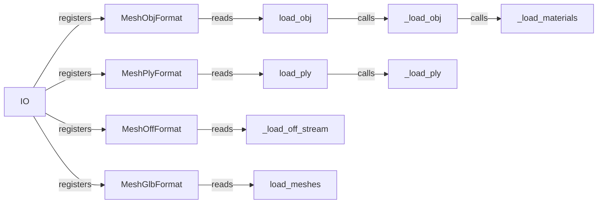

## Component Details

The I/O Abstraction component in PyTorch3D provides a unified interface for loading and saving 3D data from various file formats, such as OBJ, PLY, OFF, and GLB. It abstracts away the complexities of different file formats, allowing users to easily import and export 3D models and scenes. The central `IO` class acts as a registry for different file format handlers, enabling the system to support a wide range of formats and to be extended with custom format handlers. The loading process typically involves parsing the file content, extracting vertex and face data, and potentially loading material properties and textures. The component streamlines the process of bringing 3D data into and out of the PyTorch3D ecosystem.

### IO
The `IO` class serves as a central registry for different file formats. It allows registering custom format handlers and provides a unified interface for loading and saving meshes and point clouds. It initializes and registers default formats.
- **Related Classes/Methods**: `pytorch3d.io.pluggable.IO`

### MeshObjFormat
Handles reading and writing meshes in OBJ format. It uses `load_obj` and `save_obj` functions to perform the actual loading and saving operations.
- **Related Classes/Methods**: `pytorch3d.io.obj_io.MeshObjFormat`

### load_obj
Loads a mesh from an OBJ file. It calls `_load_obj` to parse the file content and potentially loads material files (MTL) using `_load_materials`.
- **Related Classes/Methods**: `pytorch3d.io.obj_io:load_obj`

### _load_obj
Parses the OBJ file content. It uses `_parse_obj` to extract vertex and face data and `_load_materials` to load material properties.
- **Related Classes/Methods**: `pytorch3d.io.obj_io:_load_obj`

### _load_materials
Loads material properties from an MTL file, using `mtl_io.load_mtl` to parse the MTL file.
- **Related Classes/Methods**: `pytorch3d.io.obj_io:_load_materials`

### MeshPlyFormat
Handles reading and writing meshes in PLY format. It uses `load_ply` and `save_ply` functions.
- **Related Classes/Methods**: `pytorch3d.io.ply_io.MeshPlyFormat`

### load_ply
Loads a mesh from a PLY file. It calls `_load_ply` to parse the file content.
- **Related Classes/Methods**: `pytorch3d.io.ply_io:load_ply`

### _load_ply
Parses the PLY file content. It uses `_load_ply_raw` to read the raw data.
- **Related Classes/Methods**: `pytorch3d.io.ply_io:_load_ply`

### MeshOffFormat
Handles reading and writing meshes in OFF format. It uses `_load_off_stream`.
- **Related Classes/Methods**: `pytorch3d.io.off_io.MeshOffFormat`

### MeshGlbFormat
Handles reading and writing meshes in GLB format. It uses `load_meshes`.
- **Related Classes/Methods**: `pytorch3d.io.experimental_gltf_io.MeshGlbFormat`
