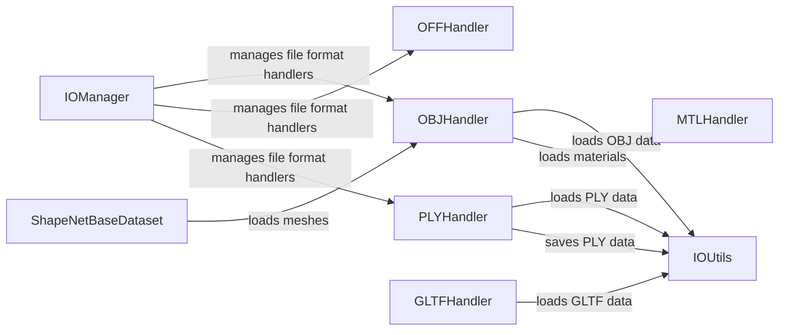

## Component Details

### IOManager
The IOManager serves as a central point for handling 3D data I/O operations. It employs a pluggable system, allowing different file format handlers to be registered and utilized seamlessly. This component abstracts the complexity of format detection and delegates the actual I/O tasks to the appropriate handler, providing a unified interface for loading and saving 3D data.
- **Related Classes/Methods**: `pytorch3d.io.pluggable.IO`

### OBJHandler
The OBJHandler is responsible for loading and saving 3D meshes in the OBJ file format. It parses the OBJ file, extracting vertex positions, texture coordinates, normals, and faces. It also supports loading material files (MTL) associated with the OBJ mesh, which define the surface properties and textures.
- **Related Classes/Methods**: `pytorch3d.io.obj_io`

### PLYHandler
The PLYHandler handles the loading and saving of 3D meshes and point clouds in the PLY file format. It supports both ASCII and binary PLY files and provides functions for reading and writing vertex and face data.
- **Related Classes/Methods**: `pytorch3d.io.ply_io`

### OFFHandler
The OFFHandler is responsible for loading 3D meshes in the OFF file format. It parses the OFF file format, extracting vertex and face data to construct the mesh.
- **Related Classes/Methods**: `pytorch3d.io.off_io`

### MTLHandler
The MTLHandler handles the loading of material files (MTL) associated with OBJ meshes. It parses the MTL file format, extracting information about surface colors, textures, and other material properties.
- **Related Classes/Methods**: `pytorch3d.io.mtl_io`

### GLTFHandler
The GLTFHandler is responsible for loading and saving 3D meshes in the GLTF file format. It handles parsing the GLTF file format, including mesh geometry, materials, textures, and animations.
- **Related Classes/Methods**: `pytorch3d.io.experimental_gltf_io`

### IOUtils
The IOUtils module provides utility functions for file I/O operations, such as opening files, reading image data, and handling file paths. These functions are used by the format-specific handlers to perform low-level I/O operations.
- **Related Classes/Methods**: `pytorch3d.io.utils`

### ShapeNetBaseDataset
The ShapeNetBaseDataset class serves as a base class for ShapeNet datasets. It provides common functionality for loading meshes from OBJ files, using the OBJHandler module.
- **Related Classes/Methods**: `pytorch3d.datasets.shapenet_base.ShapeNetBase`
