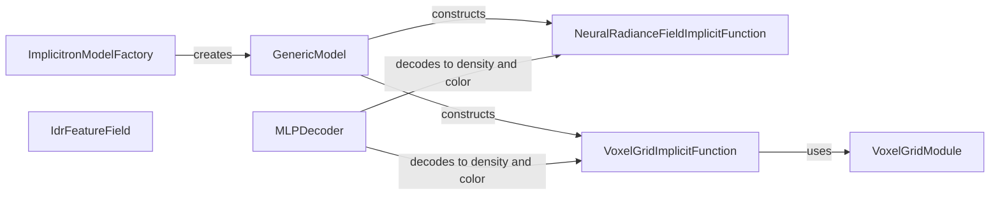

## Component Details

The implicit function component defines the core mapping from 3D coordinates to scene properties like density and color, enabling implicit representation learning. It encompasses various modules for decoding features, representing scenes with neural radiance fields or voxel grids, and handling different network architectures. The process begins with an implicit function, such as a Neural Radiance Field or Voxel Grid, which takes 3D coordinates as input. This function often utilizes decoding functions like MLPs to transform features into density and color values. The resulting density and color are then used to render the scene from different viewpoints.

### ImplicitronModelFactory
The ImplicitronModelFactory is responsible for creating implicit models based on configuration parameters. It acts as a central point for instantiating different types of implicit functions and models within the implicitron framework.
- **Related Classes/Methods**: `pytorch3d.projects.implicitron.impl.model_factory.ImplicitronModelFactory`

### GenericModel
The GenericModel serves as a base class for specific implicit models, providing a common interface and handling the construction of implicit functions. It encapsulates the overall structure of an implicit model and manages the interaction between different components.
- **Related Classes/Methods**: `pytorch3d.implicitron.models.generic_model.GenericModel`

### NeuralRadianceFieldImplicitFunction
The NeuralRadianceFieldImplicitFunction represents a scene using a neural radiance field. It takes 3D coordinates and viewing directions as input and outputs density and color values, which are then used to render the scene. It inherits from NeuralRadianceFieldBase.
- **Related Classes/Methods**: `pytorch3d.implicitron.models.implicit_function.neural_radiance_field.NeuralRadianceFieldImplicitFunction`

### MLPDecoder
The MLPDecoder is a multi-layer perceptron that decodes features into density and color values. It is used within implicit functions to transform intermediate features into the final scene properties.
- **Related Classes/Methods**: `pytorch3d.implicitron.models.implicit_function.decoding_functions.MLPDecoder`

### VoxelGridImplicitFunction
The VoxelGridImplicitFunction represents a scene using a voxel grid. It stores density and color values in a 3D grid and interpolates them to evaluate the function at arbitrary 3D coordinates. It uses VoxelGridModule to manage the voxel grid data structure.
- **Related Classes/Methods**: `pytorch3d.implicitron.models.implicit_function.voxel_grid_implicit_function.VoxelGridImplicitFunction`

### VoxelGridModule
The VoxelGridModule manages the voxel grid data structure and provides methods for evaluating and manipulating the grid. It supports different types of voxel grids, such as FullResolutionVoxelGrid, CPFactorizedVoxelGrid, and VMFactorizedVoxelGrid.
- **Related Classes/Methods**: `pytorch3d.implicitron.models.implicit_function.voxel_grid.VoxelGridModule`

### IdrFeatureField
The IdrFeatureField is an implicit differentiable renderer feature field. It is used to extract features from the input 3D coordinates and viewing directions, which are then used by the decoding functions.
- **Related Classes/Methods**: `pytorch3d.implicitron.models.implicit_function.idr_feature_field.IdrFeatureField`
