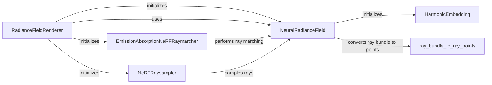

## Component Details

### RadianceFieldRenderer
The RadianceFieldRenderer class is responsible for rendering a scene using a Neural Radiance Field (NeRF). It orchestrates the ray sampling, ray marching, and radiance field evaluation processes to generate rendered images from a given scene representation.
- **Related Classes/Methods**: `repos.pytorch3d.projects.nerf.nerf.nerf_renderer.RadianceFieldRenderer`

### EmissionAbsorptionNeRFRaymarcher
The EmissionAbsorptionNeRFRaymarcher performs ray marching using the emission-absorption model, which is commonly used in NeRF. It integrates the density and color values along each ray to estimate the final color of the pixel, simulating the light transport process within the scene.
- **Related Classes/Methods**: `repos.pytorch3d.projects.nerf.nerf.raymarcher.EmissionAbsorptionNeRFRaymarcher`

### NeRFRaysampler
The NeRFRaysampler is responsible for generating ray samples along which the radiance field will be evaluated. It supports different sampling strategies, such as uniform sampling and stratified sampling, to efficiently explore the scene and capture its details.
- **Related Classes/Methods**: `repos.pytorch3d.projects.nerf.nerf.raysampler.NeRFRaysampler`

### NeuralRadianceField
The NeuralRadianceField (NeRF) is an implicit function, typically implemented as a neural network, that maps 3D coordinates and viewing directions to color and density values. It represents the scene as a continuous function, allowing for novel view synthesis and 3D reconstruction.
- **Related Classes/Methods**: `repos.pytorch3d.projects.nerf.nerf.implicit_function.NeuralRadianceField`

### HarmonicEmbedding
HarmonicEmbedding is a technique for encoding input coordinates using harmonic functions. This can help to improve the performance of NeRF by allowing the network to learn high-frequency details in the scene, capturing fine-grained geometric and appearance variations.
- **Related Classes/Methods**: `pytorch3d.renderer.implicit.harmonic_embedding.HarmonicEmbedding`

### ray_bundle_to_ray_points
ray_bundle_to_ray_points converts a ray bundle (origins, directions, lengths) to 3D points along the rays. This utility function facilitates the evaluation of the radiance field at specific locations along the rays.
- **Related Classes/Methods**: `repos.pytorch3d.pytorch3d.renderer.implicit.utils.ray_bundle_to_ray_points`
