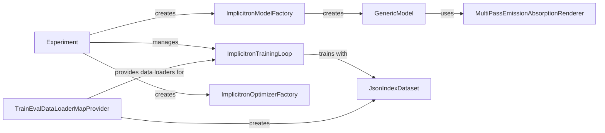

## Component Details

The Implicitron framework facilitates the training and evaluation of implicit 3D representations. It encompasses data loading, model definition, training loops, and evaluation metrics. The core flow involves loading data using data loaders, defining a 3D representation model (e.g., NeRF), training the model using an optimizer and a training loop, and evaluating the model's performance. The framework simplifies the development and deployment of implicit 3D representation learning models.

### Experiment
The Experiment class orchestrates the training process. It loads configurations, initializes the training loop, manages checkpointing, and coordinates the overall experiment execution.
- **Related Classes/Methods**: `pytorch3d.projects.implicitron_trainer.experiment.Experiment`

### ImplicitronTrainingLoop
The ImplicitronTrainingLoop class implements the core training logic. It iterates through epochs and batches, performs forward and backward passes, calculates losses, and updates model parameters using the optimizer.
- **Related Classes/Methods**: `pytorch3d.projects.implicitron_trainer.impl.training_loop.ImplicitronTrainingLoop`

### ImplicitronModelFactory
The ImplicitronModelFactory class is responsible for creating instances of the implicit neural representation model. It encapsulates the model instantiation logic based on the experiment configuration.
- **Related Classes/Methods**: `pytorch3d.projects.implicitron_trainer.impl.model_factory.ImplicitronModelFactory`

### GenericModel
The GenericModel class serves as an abstract base class for implicit representation models. It provides common functionalities such as rendering and loss calculation, which are inherited and customized by specific model implementations.
- **Related Classes/Methods**: `pytorch3d.implicitron.models.generic_model.GenericModel`

### MultiPassEmissionAbsorptionRenderer
The MultiPassEmissionAbsorptionRenderer class implements a rendering algorithm that simulates light transport through the implicit representation. It generates images from the learned scene representation by accumulating emission and absorption along rays.
- **Related Classes/Methods**: `pytorch3d.implicitron.models.renderer.multipass_ea.MultiPassEmissionAbsorptionRenderer`

### TrainEvalDataLoaderMapProvider
The TrainEvalDataLoaderMapProvider class creates and manages data loaders for both training and evaluation datasets. It provides batches of data to the training loop and evaluation scripts.
- **Related Classes/Methods**: `pytorch3d.implicitron.dataset.train_eval_data_loader_provider.TrainEvalDataLoaderMapProvider`

### JsonIndexDataset
The JsonIndexDataset class loads and manages the training data from a JSON index file. It provides access to images, camera parameters, and other scene information required for training and evaluation.
- **Related Classes/Methods**: `pytorch3d.implicitron.dataset.json_index_dataset.JsonIndexDataset`

### ImplicitronOptimizerFactory
The ImplicitronOptimizerFactory creates and configures the optimizer used for training the implicit representation. It encapsulates the optimizer instantiation logic based on the experiment configuration.
- **Related Classes/Methods**: `pytorch3d.projects.implicitron_trainer.impl.optimizer_factory.ImplicitronOptimizerFactory`
