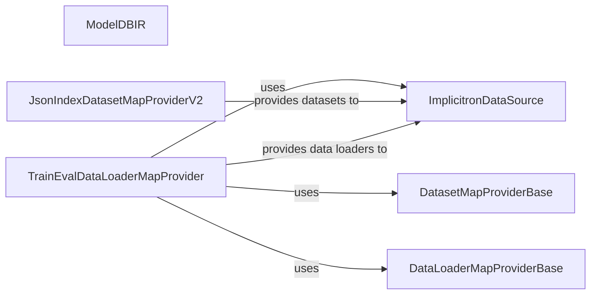

## Component Details

### ModelDBIR
A depth-based image rendering model. It unprojects all RGBD maps to a colored point cloud and renders into the target views. It leverages depth information to enhance the rendering process, making it suitable for scenarios where depth data is available.
- **Related Classes/Methods**: `pytorch3d.implicitron.models.model_dbir.ModelDBIR`

### ImplicitronDataSource
Represents the data used in Implicitron. It encapsulates Dataset and DataLoader configuration, providing a unified interface for accessing and managing training and evaluation data. It abstracts away the complexities of data loading and preprocessing, allowing the models to focus on learning from the data.
- **Related Classes/Methods**: `pytorch3d.implicitron.dataset.data_source.ImplicitronDataSource`

### DatasetMapProviderBase
Base class for dataset map providers. Dataset map providers are responsible for creating a map of datasets, allowing for flexible and configurable data loading strategies. It defines the interface for creating dataset maps, which are used by data sources to access the data.
- **Related Classes/Methods**: `pytorch3d.implicitron.dataset.dataset_map_provider.DatasetMapProviderBase`

### DataLoaderMapProviderBase
Base class for data loader map providers. Data loader map providers are responsible for creating a map of data loaders, enabling efficient data loading and batching. It defines the interface for creating data loader maps, which are used by data sources to load the data in batches.
- **Related Classes/Methods**: `pytorch3d.implicitron.dataset.data_loader_map_provider.DataLoaderMapProviderBase`

### JsonIndexDatasetMapProviderV2
Provides a map of datasets, loading data from JSON index files for different categories and subsets. It manages the creation and configuration of JsonIndexDataset instances, providing a convenient way to load data from JSON files.
- **Related Classes/Methods**: `pytorch3d.implicitron.dataset.json_index_dataset_map_provider_v2.JsonIndexDatasetMapProviderV2`

### TrainEvalDataLoaderMapProvider
Provides a map of data loaders for training and evaluation. It manages the creation and configuration of data loaders, including the use of SceneBatchSampler for training data, ensuring efficient and effective training and evaluation.
- **Related Classes/Methods**: `pytorch3d.implicitron.dataset.train_eval_data_loader_provider.TrainEvalDataLoaderMapProvider`
