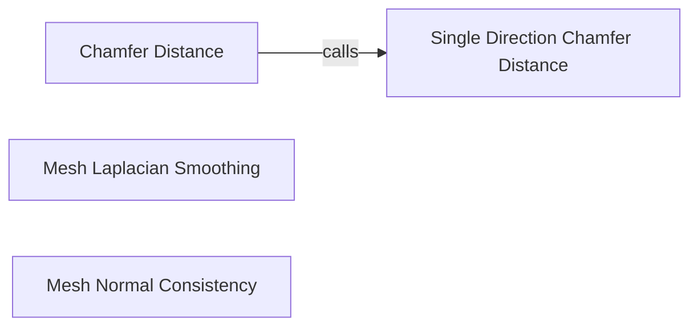

## Component Details

The Loss Functions component in PyTorch3D provides a set of tools for evaluating the quality of 3D shapes, primarily meshes and point clouds. It includes functions for calculating Chamfer distance between point clouds, Laplacian smoothing loss to encourage mesh smoothness, and normal consistency loss to promote coherent surface orientations. These loss functions are essential for training 3D deep learning models, enabling them to generate accurate and visually appealing 3D structures by quantifying the difference between predicted and ground truth data.

### Chamfer Distance
The Chamfer Distance component calculates the similarity between two point clouds by measuring the average distance from each point in one set to its nearest neighbor in the other set. It provides a comprehensive measure of shape similarity, considering both the proximity and distribution of points. This component is crucial for tasks like shape reconstruction and registration, where accurate alignment and similarity assessment are essential.
- **Related Classes/Methods**: `pytorch3d.loss.chamfer:chamfer_distance`

### Single Direction Chamfer Distance
The Single Direction Chamfer Distance component calculates the Chamfer distance from one point cloud to another, but only in one direction. This is a helper function used by the Chamfer Distance component. It computes the minimum distance from each point in the first point cloud to any point in the second point cloud, providing a one-sided measure of proximity.
- **Related Classes/Methods**: `pytorch3d.loss.chamfer:_chamfer_distance_single_direction`

### Mesh Laplacian Smoothing
The Mesh Laplacian Smoothing component calculates a loss that encourages mesh smoothness by penalizing large differences between vertex positions and their neighbors. It operates by applying a Laplacian operator to the mesh vertices, effectively smoothing out irregularities and reducing noise. This component is vital for generating visually appealing and physically plausible 3D models.
- **Related Classes/Methods**: `pytorch3d.loss.mesh_laplacian_smoothing:mesh_laplacian_smoothing`

### Mesh Normal Consistency
The Mesh Normal Consistency component calculates a loss that encourages neighboring faces in a mesh to have similar normal vectors, leading to smoother and more coherent surfaces. It promotes surface smoothness and reduces artifacts by aligning the orientations of adjacent faces. This component is essential for creating high-quality 3D models with consistent surface properties.
- **Related Classes/Methods**: `pytorch3d.loss.mesh_normal_consistency:mesh_normal_consistency`
