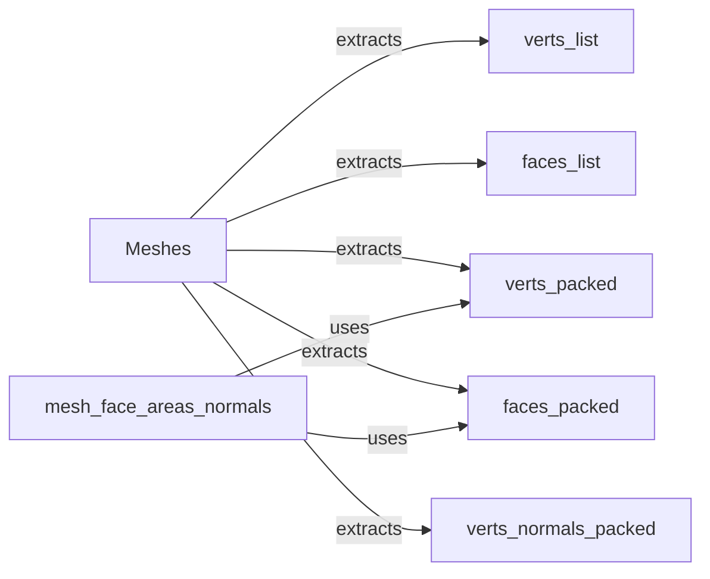

## Component Details

### Meshes
The Meshes class is a core data structure for representing batches of triangulated meshes in PyTorch3D. It handles meshes with varying numbers of vertices and faces, and provides functionalities for converting between different representations (list, padded, and packed). It also offers methods for accessing and manipulating mesh data, such as vertex and face lists, normals, and edges.
- **Related Classes/Methods**: `pytorch3d.structures.meshes.Meshes`

### verts_list
This component extracts the list representation of the vertices from the Meshes object. The vertices are stored as a list of tensors, where each tensor represents the vertices of a single mesh in the batch.
- **Related Classes/Methods**: `pytorch3d.structures.meshes.Meshes`

### faces_list
This component extracts the list representation of the faces from the Meshes object. The faces are stored as a list of tensors, where each tensor represents the faces of a single mesh in the batch. Each face is defined by the indices of its three vertices.
- **Related Classes/Methods**: `pytorch3d.structures.meshes.Meshes`

### verts_packed
This component extracts the packed representation of the vertices from the Meshes object. In the packed representation, all vertices from all meshes are concatenated into a single tensor. This representation is efficient for certain operations, such as computing per-vertex normals.
- **Related Classes/Methods**: `pytorch3d.structures.meshes.Meshes`

### faces_packed
This component extracts the packed representation of the faces from the Meshes object. In the packed representation, all faces from all meshes are concatenated into a single tensor. This representation is efficient for certain operations, such as computing per-face normals.
- **Related Classes/Methods**: `pytorch3d.structures.meshes.Meshes`

### mesh_face_areas_normals
This component computes the area and normal of each face in a mesh. It takes the packed vertices and faces as input and returns the area and normal for each face. The normal is computed using the cross product of two edges of the face.
- **Related Classes/Methods**: `pytorch3d.ops.mesh_face_areas_normals`

### verts_normals_packed
This component computes the packed version of vertex normals from the packed vertices and faces. It assumes that vertices are shared between faces. The normal for a vertex is computed as the sum of the normals of all the faces it is part of, weighted by the face areas.
- **Related Classes/Methods**: `pytorch3d.structures.meshes.Meshes`
