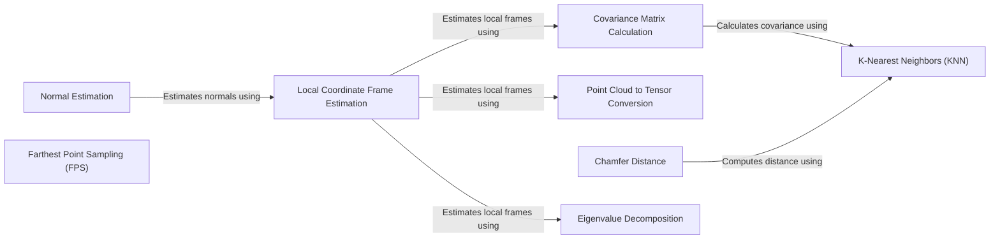

## Component Details

### Normal Estimation
Estimates the normals of a point cloud. It involves estimating local coordinate frames, calculating point covariances, performing eigen decomposition, disambiguating vector directions, and converting the point cloud to a tensor. The normal estimation is a crucial step for many point cloud processing tasks, such as surface reconstruction and feature extraction.
- **Related Classes/Methods**: `pytorch3d.ops.points_normals`

### K-Nearest Neighbors (KNN)
Finds the k-nearest neighbors for a set of query points in a target point cloud. It returns the distances and indices of the nearest neighbors. KNN search is a fundamental operation used in various point cloud processing tasks, including normal estimation, feature extraction, and surface reconstruction. The implementation uses efficient algorithms to accelerate the search process.
- **Related Classes/Methods**: `pytorch3d.ops.knn`

### Chamfer Distance
Computes the Chamfer distance between two point clouds. It measures the average distance from each point in one point cloud to its nearest neighbor in the other point cloud. Chamfer distance is a widely used metric for evaluating the similarity between two point clouds, particularly in tasks such as shape matching and reconstruction. The implementation handles input validation, preprocesses the point clouds, computes the Chamfer distance in both directions, and applies a reduction operation.
- **Related Classes/Methods**: `pytorch3d.loss.chamfer`

### Farthest Point Sampling (FPS)
Samples a subset of points from a point cloud using the farthest point sampling algorithm. FPS iteratively selects points that are farthest away from the already selected points, resulting in a uniform sampling of the point cloud. FPS is commonly used for point cloud simplification and data reduction while preserving the overall shape and structure of the point cloud.
- **Related Classes/Methods**: `pytorch3d.ops.sample_farthest_points`

### Local Coordinate Frame Estimation
Estimates the local coordinate frames for each point in a point cloud. This involves converting the point cloud to a tensor, calculating point covariances, performing eigen decomposition, and disambiguating vector directions. The local coordinate frame provides a reference frame for describing the local geometry around each point, which is useful for tasks such as normal estimation and feature extraction.
- **Related Classes/Methods**: `pytorch3d.ops.points_normals`

### Point Cloud to Tensor Conversion
Converts a Pointclouds object to a dense tensor representation. This conversion is often necessary for processing point clouds using PyTorch operations. The tensor representation allows for efficient batch processing and integration with other deep learning modules.
- **Related Classes/Methods**: `pytorch3d.ops.utils`

### Covariance Matrix Calculation
Calculates the covariance matrices of the neighboring points for each point in a point cloud. This is used to estimate the local structure around each point. The covariance matrix captures the spread and orientation of the neighboring points, providing information about the local surface geometry.
- **Related Classes/Methods**: `pytorch3d.ops.utils`

### Eigenvalue Decomposition
Computes the eigenvalues and eigenvectors of a batch of 3x3 symmetric matrices. This is used in local coordinate frame estimation to determine the principal directions of the local surface. The eigenvectors represent the principal axes of the local coordinate frame, and the eigenvalues represent the variance along each axis.
- **Related Classes/Methods**: `pytorch3d.common.workaround`
