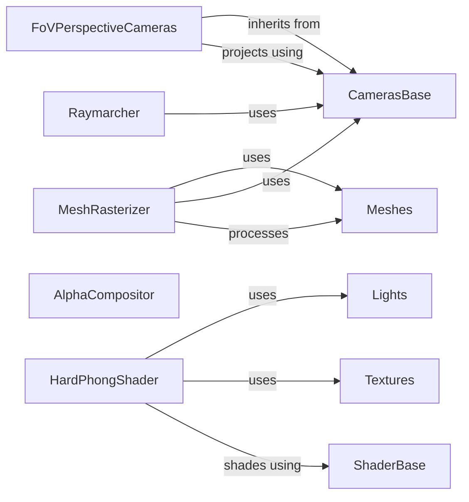

## Component Details

The Rendering Pipeline is responsible for transforming 3D scene data into 2D images. It encompasses several key stages, including camera setup, mesh rasterization or ray tracing, shading, and compositing. The pipeline begins with defining the scene's camera using components like `CamerasBase` and `FoVPerspectiveCameras`. Meshes are then processed by either `MeshRasterizer` or a raymarching approach using `EmissionAbsorptionRaymarcher` and `MultinomialRaysampler`. The `ShaderBase` and its implementations, such as `HardPhongShader`, determine the final color of each pixel based on lighting and material properties, utilizing light sources like `DirectionalLights`, `PointLights`, and `AmbientLights`, as well as textures. Finally, the rendered colors are composited using components like `AlphaCompositor` to produce the final image.

### Meshes
Represents a batch of 3D meshes, storing vertices, faces, and optional textures. It provides methods for manipulating the meshes, such as transforming, offsetting, scaling, and sampling textures. It serves as the fundamental 3D object representation within the rendering pipeline.
- **Related Classes/Methods**: `pytorch3d.structures.meshes.Meshes`

### CamerasBase
Abstract base class for camera models. It provides methods for transforming 3D points from world coordinates to view coordinates and then to normalized device coordinates (NDC). It also provides methods for projecting and unprojecting points. It defines the interface for different camera models used in the rendering process.
- **Related Classes/Methods**: `pytorch3d.renderer.cameras.CamerasBase`

### FoVPerspectiveCameras
A concrete camera model that represents a perspective camera with a field of view. It inherits from CamerasBase and provides specific implementations for projection and unprojection based on the field of view. It's a specific type of camera used to simulate perspective projection.
- **Related Classes/Methods**: `pytorch3d.renderer.cameras.FoVPerspectiveCameras`

### MeshRasterizer
Rasterizes a batch of meshes. It takes the transformed vertices and faces of the meshes and determines which pixels are covered by the meshes. It outputs fragments, which contain information about the covered pixels, such as the depth and barycentric coordinates. It's a core component for converting 3D meshes into 2D pixel fragments.
- **Related Classes/Methods**: `pytorch3d.renderer.mesh.rasterizer.MeshRasterizer`, `pytorch3d.renderer.mesh.rasterize_meshes`

### ShaderBase
Abstract base class for shaders. Shaders are responsible for computing the color of each pixel based on lighting, material properties, and textures. It defines the interface for different shading models used in the rendering process.
- **Related Classes/Methods**: `pytorch3d.renderer.mesh.shader.ShaderBase`

### HardPhongShader
A concrete shader that implements the Phong shading model. It computes the color of each pixel based on the diffuse, specular, and ambient lighting components. It's a specific shading model used to simulate realistic lighting effects.
- **Related Classes/Methods**: `pytorch3d.renderer.mesh.shader.HardPhongShader`

### Lights
Represents different types of lights in the scene, including directional, point, and ambient lights. It stores the properties of the lights and provides methods for computing the lighting components. It provides the light sources for the shading process.
- **Related Classes/Methods**: `pytorch3d.renderer.lighting.DirectionalLights`, `pytorch3d.renderer.lighting.PointLights`, `pytorch3d.renderer.lighting.AmbientLights`

### Textures
Represents different types of textures, including texture atlases, UV maps, and vertex colors. It stores the texture data and provides methods for sampling textures. It provides the surface details for the shading process.
- **Related Classes/Methods**: `pytorch3d.renderer.mesh.textures.TexturesAtlas`, `pytorch3d.renderer.mesh.textures.TexturesUV`, `pytorch3d.renderer.mesh.textures.TexturesVertex`

### AlphaCompositor
Composites the rendered colors using alpha blending. It combines the colors of different fragments based on their alpha values to produce the final image. It's a core component for blending different layers of the rendered image.
- **Related Classes/Methods**: `pytorch3d.renderer.points.compositor.AlphaCompositor`

### Raymarcher
Raymarcher that integrates the emission and absorption along a ray. It is used in implicit rendering to generate images from volumetric data. It samples along rays and accumulates color and density values.
- **Related Classes/Methods**: `pytorch3d.renderer.implicit.raymarching.EmissionAbsorptionRaymarcher`, `pytorch3d.renderer.implicit.raysampling.MultinomialRaysampler`
