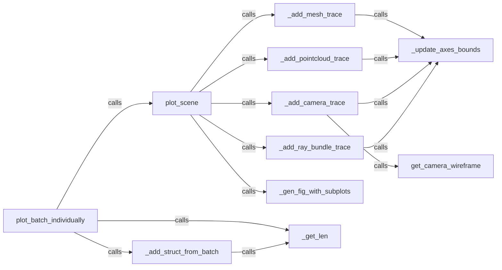

## Component Details

### plot_scene
The `plot_scene` function serves as the primary interface for visualizing 3D scenes within PyTorch3D. It accepts Cameras, Meshes, Pointclouds, and RayBundle objects as input and renders them into a Plotly figure with named subplots and traces. This function orchestrates the process of adding different trace types (mesh, pointcloud, camera, ray bundle) to the figure, effectively providing a high-level API for scene visualization.
- **Related Classes/Methods**: `pytorch3d.vis.plotly_vis:plot_scene`

### plot_batch_individually
The `plot_batch_individually` function extends the capabilities of `plot_scene` by providing a mechanism to visualize batched data. It automatically creates separate subplots for each element in the batch, simplifying the process of plotting multiple instances of Cameras, Meshes, Pointclouds, or RayBundles. This function leverages `plot_scene` to render each individual element within its respective subplot.
- **Related Classes/Methods**: `pytorch3d.vis.plotly_vis:plot_batch_individually`

### _add_struct_from_batch
The `_add_struct_from_batch` function is responsible for extracting a single structure (Cameras, Meshes, Pointclouds, or RayBundle) from a batch and adding it to a specified subplot within the scene. It handles indexing into batched structures, ensuring that the correct data is associated with each subplot. This function is a key component in the process of visualizing batched data, as it enables the individual rendering of each element within the batch.
- **Related Classes/Methods**: `pytorch3d.vis.plotly_vis:_add_struct_from_batch`

### _add_mesh_trace
The `_add_mesh_trace` function focuses on rendering Meshes objects within a Plotly figure. It converts the Meshes object into a format compatible with Plotly and adds a trace representing the mesh to a specified subplot. This function handles vertex and face colors, allowing for detailed and visually appealing mesh representations.
- **Related Classes/Methods**: `pytorch3d.vis.plotly_vis:_add_mesh_trace`

### _add_pointcloud_trace
The `_add_pointcloud_trace` function is responsible for rendering Pointclouds objects within a Plotly figure. It converts the Pointclouds object into a format suitable for Plotly and adds a trace representing the point cloud to a specified subplot. This function handles point colors, enabling the visualization of colored point clouds.
- **Related Classes/Methods**: `pytorch3d.vis.plotly_vis:_add_pointcloud_trace`

### _add_camera_trace
The `_add_camera_trace` function renders Cameras objects within a Plotly figure. It uses a wireframe representation for the camera, providing a visual indication of the camera's position and orientation. This function relies on `get_camera_wireframe` to generate the wireframe geometry.
- **Related Classes/Methods**: `pytorch3d.vis.plotly_vis:_add_camera_trace`

### _add_ray_bundle_trace
The `_add_ray_bundle_trace` function renders RayBundle objects within a Plotly figure. It converts the RayBundle object into a format suitable for Plotly, plotting both the ray lines and the ray points. This function enables the visualization of ray trajectories and their associated points.
- **Related Classes/Methods**: `pytorch3d.vis.plotly_vis:_add_ray_bundle_trace`

### get_camera_wireframe
The `get_camera_wireframe` function generates a wireframe representation of a camera as a 3D line plot. This wireframe is used by `_add_camera_trace` to visualize camera objects within the Plotly figure. The function returns the coordinates of the wireframe lines, which are then used to create the camera trace.
- **Related Classes/Methods**: `pytorch3d.vis.plotly_vis:get_camera_wireframe`

### _update_axes_bounds
The `_update_axes_bounds` function adjusts the bounds of the axes in a subplot to ensure that all traces within that subplot are visible. It dynamically updates the x, y, and z axis ranges to fit the plotted objects, preventing clipping and ensuring that the entire scene is displayed correctly.
- **Related Classes/Methods**: `pytorch3d.vis.plotly_vis:_update_axes_bounds`

### _gen_fig_with_subplots
The `_gen_fig_with_subplots` function creates a Plotly figure with a specified number of subplots, arranged in rows and columns. It sets up the basic structure of the figure before any traces are added. This function is used by `plot_scene` and `plot_batch_individually` to create the initial figure layout.
- **Related Classes/Methods**: `pytorch3d.vis.plotly_vis:_gen_fig_with_subplots`
