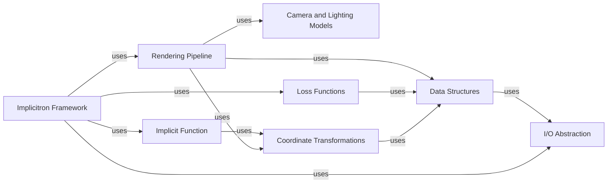

## Component Details

PyTorch3D is a library for deep learning with 3D data. It provides data structures and functionalities for manipulating and rendering 3D meshes, point clouds, and volumes. The library is designed to be modular and extensible, allowing users to easily integrate custom data loaders, loss functions, and rendering techniques. It also includes a framework for training and evaluating implicit 3D representations, such as neural radiance fields (NeRFs).

### Data Structures
This component encompasses the fundamental data structures for representing 3D data, including meshes, point clouds, and volumes. It provides functionalities for creating, manipulating, and accessing these structures, ensuring efficient storage and retrieval of 3D information. It plays a central role in representing the 3D world for other components.
- **Related Classes/Methods**: `pytorch3d.structures.meshes.Meshes`, `pytorch3d.structures.pointclouds.Pointclouds`, `pytorch3d.structures.volumes.Volumes`

### I/O Abstraction
This component handles the input and output of 3D data from various file formats. It provides a unified interface for loading and saving 3D models, scenes, and other data types, abstracting away the complexities of different file formats. It acts as the gateway for bringing 3D data into and out of the PyTorch3D ecosystem.
- **Related Classes/Methods**: `pytorch3d.io.pluggable.IO`, `pytorch3d.io.obj_io`, `pytorch3d.io.ply_io`, `pytorch3d.io.off_io`, `pytorch3d.io.experimental_gltf_io`

### Camera and Lighting Models
This component defines various camera models (perspective, orthographic, fisheye) and lighting models (directional, point, ambient). It provides functionalities for projecting 3D points to 2D image coordinates, transforming points between coordinate systems, and computing the color and intensity of light. It is essential for simulating realistic 3D scenes and rendering them from different viewpoints.
- **Related Classes/Methods**: `pytorch3d.renderer.cameras.CamerasBase`, `pytorch3d.renderer.cameras.PerspectiveCameras`, `pytorch3d.renderer.lighting.DirectionalLights`, `pytorch3d.renderer.lighting.PointLights`, `pytorch3d.renderer.lighting.AmbientLights`

### Rendering Pipeline
This component provides functionalities for rendering 3D data using different rendering techniques, such as rasterization and ray tracing. It includes modules for clipping, rasterizing, shading meshes, and compositing point clouds. It is responsible for generating 2D images from 3D scenes, enabling visualization and analysis of 3D data.
- **Related Classes/Methods**: `pytorch3d.renderer.mesh.rasterizer.MeshRasterizer`, `pytorch3d.renderer.mesh.rasterize_meshes`, `pytorch3d.renderer.mesh.shader.ShaderBase`, `pytorch3d.renderer.points.rasterizer.PointsRasterizer`, `pytorch3d.renderer.points.rasterize_points`, `pytorch3d.renderer.implicit.raysampling`, `pytorch3d.renderer.implicit.raymarching`

### Coordinate Transformations
This component provides functionalities for performing 3D coordinate transformations, such as rotations, translations, and scaling. It includes modules for converting between different rotation representations. It is crucial for aligning 3D models, transforming points between coordinate systems, and manipulating 3D scenes.
- **Related Classes/Methods**: `pytorch3d.transforms.transform3d.Transform3d`, `pytorch3d.transforms.rotation_conversions`

### Loss Functions
This component defines various loss functions for optimizing 3D scene parameters, such as Chamfer distance, mesh Laplacian smoothing, and normal consistency. It is used to train 3D deep learning models by quantifying the difference between predicted and ground truth 3D data.
- **Related Classes/Methods**: `pytorch3d.loss.chamfer`, `pytorch3d.loss.mesh_laplacian_smoothing`, `pytorch3d.loss.mesh_normal_consistency`

### Implicitron Framework
This component provides a framework for training and evaluating implicit 3D representations, such as neural radiance fields (NeRFs). It includes modules for data loading, model definition, training loop, and evaluation metrics. It simplifies the process of developing and deploying implicit 3D representation learning models.
- **Related Classes/Methods**: `pytorch3d.implicitron.models.generic_model.GenericModel`, `pytorch3d.implicitron.dataset.data_source.ImplicitronDataSource`, `pytorch3d.implicitron.evaluation.evaluator.ImplicitronEvaluator`

### Implicit Function
This component defines the implicit function to be used by the implicitron framework. It includes modules for decoding functions, idr feature fields, neural radiance fields and voxel grids. It is the core of the implicit representation learning process, defining the function that maps 3D coordinates to scene properties.
- **Related Classes/Methods**: `pytorch3d.implicitron.models.implicit_function.base`, `pytorch3d.implicitron.models.implicit_function.neural_radiance_field`