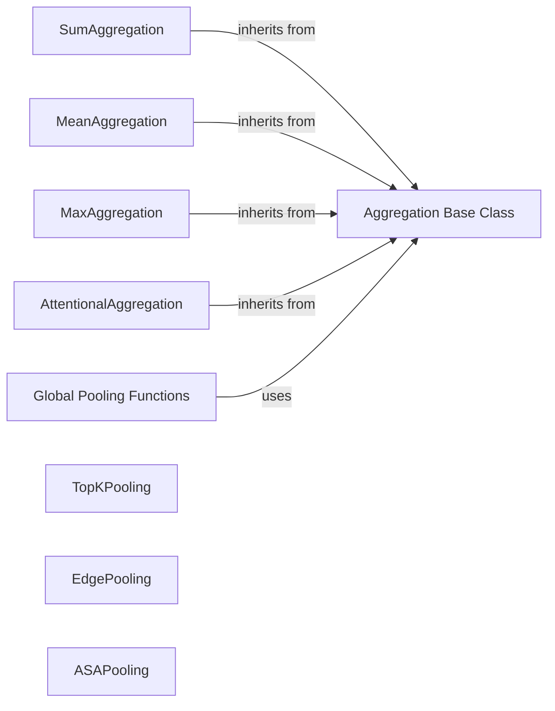

## Component Details

The Aggregation and Pooling Operations component provides mechanisms for summarizing node features within a graph, either by aggregating features from neighboring nodes or by downsampling the graph structure itself. Aggregation operations combine node features into a single representation, while pooling operations reduce the graph's size while preserving important structural information. These operations are crucial for building hierarchical graph representations and extracting meaningful features for downstream tasks.

### Aggregation Base Class
The `Aggregation` base class defines the interface for all aggregation modules. It provides methods for handling sparse and dense data, and for reducing node features based on indices. It serves as an abstract class for different aggregation strategies.
- **Related Classes/Methods**: `pytorch_geometric.nn.aggr.base.Aggregation`

### SumAggregation
The `SumAggregation` module aggregates node features by summing them. It inherits from the `Aggregation` base class and implements the forward pass to perform the summation.
- **Related Classes/Methods**: `pytorch_geometric.nn.aggr.SumAggregation`

### MeanAggregation
The `MeanAggregation` module aggregates node features by averaging them. It inherits from the `Aggregation` base class and implements the forward pass to compute the mean.
- **Related Classes/Methods**: `pytorch_geometric.nn.aggr.MeanAggregation`

### MaxAggregation
The `MaxAggregation` module aggregates node features by taking the maximum value. It inherits from the `Aggregation` base class and implements the forward pass to find the maximum.
- **Related Classes/Methods**: `pytorch_geometric.nn.aggr.MaxAggregation`

### AttentionalAggregation
The `AttentionalAggregation` module aggregates node features using an attention mechanism. It learns weights for each node's contribution to the aggregated feature vector, allowing the model to focus on the most relevant nodes.
- **Related Classes/Methods**: `pytorch_geometric.nn.aggr.AttentionalAggregation`

### Global Pooling Functions
These functions perform global pooling operations on graph node features. `global_add_pool` sums the node features, `global_mean_pool` averages them, and `global_max_pool` takes the maximum. They are used to obtain a graph-level representation.
- **Related Classes/Methods**: `pytorch_geometric.nn.pool.glob:global_add_pool`, `pytorch_geometric.nn.pool.glob:global_mean_pool`, `pytorch_geometric.nn.pool.glob:global_max_pool`

### TopKPooling
The `TopKPooling` module selects the top k nodes based on their node features and creates a new graph with only those nodes and their induced edges. It reduces the graph size while preserving the most important nodes.
- **Related Classes/Methods**: `pytorch_geometric.nn.pool.TopKPooling`, `pytorch_geometric.nn.pool.topk_pool.TopKPooling`

### EdgePooling
The `EdgePooling` module pools the graph by collapsing edges. It iteratively removes edges based on a scoring function, effectively reducing the graph's size.
- **Related Classes/Methods**: `pytorch_geometric.nn.pool.EdgePooling`, `pytorch_geometric.nn.pool.edge_pool.EdgePooling`

### ASAPooling
The `ASAPooling` module (Adaptive Structure Aware Pooling) learns a soft cluster assignment for nodes and pools the graph based on these clusters. It aims to preserve the graph's structure during pooling.
- **Related Classes/Methods**: `pytorch_geometric.nn.pool.ASAPooling`, `pytorch_geometric.nn.pool.asap.ASAPooling`
