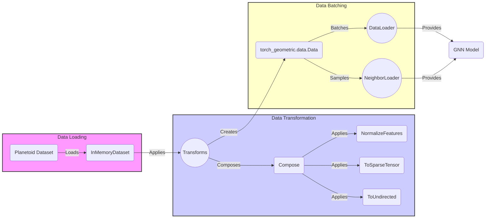

### Component Descriptions:

**1. Planetoid Dataset**
   - *Description*: Loads citation network datasets like Cora, CiteSeer, and PubMed.
   - *Functionality*: Downloads and preprocesses the dataset, making it ready for use with GNNs. It inherits from `InMemoryDataset`.
   - *Interaction*: Loads data into `InMemoryDataset`.
   - *Relevant source files*: `torch_geometric.datasets.planetoid.Planetoid`

**2. InMemoryDataset**
   - *Description*: Stores the entire dataset in memory for faster access.
   - *Functionality*: Downloads, processes, and stores graph data in memory. It provides a base class for datasets that can fit entirely in memory.
   - *Interaction*: Receives data from `Planetoid` and passes it to `Transforms`.
   - *Relevant source files*: `torch_geometric.data.in_memory_dataset.InMemoryDataset`

**3. Transforms**
   - *Description*: Applies a series of transformations to the graph data.
   - *Functionality*: Modifies the graph data, such as normalizing features or converting to undirected graphs. It uses `Compose` to chain multiple transforms.
   - *Interaction*: Receives data from `InMemoryDataset` and applies transformations before creating `torch_geometric.data.Data` objects.
   - *Relevant source files*: `torch_geometric.transforms`

**4. Compose**
   - *Description*: Composes several transforms together.
   - *Functionality*: Chains multiple transforms into a single transform.
   - *Interaction*: Used by `Transforms` to combine multiple transformations.
   - *Relevant source files*: `torch_geometric.transforms.compose.Compose`

**5. NormalizeFeatures**
   - *Description*: Normalizes the node feature matrix.
   - *Functionality*: Normalizes the node feature matrix to have zero mean and unit variance.
   - *Interaction*: Applied by `Compose` as part of the data transformation pipeline.
   - *Relevant source files*: `torch_geometric.transforms.normalize_features.NormalizeFeatures`

**6. ToSparseTensor**
   - *Description*: Converts the graph to a sparse tensor representation.
   - *Functionality*: Converts the graph's adjacency matrix to a sparse tensor format.
   - *Interaction*: Applied by `Compose` as part of the data transformation pipeline.
   - *Relevant source files*: `torch_geometric.transforms.to_sparse_tensor.ToSparseTensor`

**7. ToUndirectedGraph**
   - *Description*: Converts the graph to an undirected graph.
   - *Functionality*: Converts a directed graph to an undirected graph by making all edges bidirectional.
   - *Interaction*: Applied by `Compose` as part of the data transformation pipeline.
   - *Relevant source files*: `torch_geometric.transforms.to_undirected.ToUndirected`

**8. torch_geometric.data.Data**
   - *Description*: Represents a graph in PyTorch Geometric.
   - *Functionality*: Holds node features, edge indices, and other graph-level attributes.
   - *Interaction*: Created by `Transforms` and used by `DataLoader` and `NeighborLoader`.
   - *Relevant source files*: `torch_geometric.data.data.Data`

**9. DataLoader**
   - *Description*: Batches graphs for mini-batch training.
   - *Functionality*: Collates individual graphs into a single batch for efficient training.
   - *Interaction*: Receives `torch_geometric.data.Data` objects and provides batches to the GNN model.
   - *Relevant source files*: `torch_geometric.loader.dataloader.DataLoader`

**10. NeighborLoader**
    - *Description*: Samples subgraphs around a given set of nodes.
    - *Functionality*: Creates mini-batches by sampling neighbors around a set of seed nodes, useful for large graphs.
    - *Interaction*: Receives `torch_geometric.data.Data` objects and provides batches to the GNN model.
    - *Relevant source files*: `torch_geometric.loader.neighbor_loader.NeighborLoader`

**11. GNN Model**
    - *Description*: The Graph Neural Network model.
    - *Functionality*: Performs graph-based learning tasks such as node classification or graph classification.
    - *Interaction*: Receives batches of graph data from `DataLoader` or `NeighborLoader`.
    - *Relevant source files*: N/A (This is a placeholder for the actual GNN model implementation)
