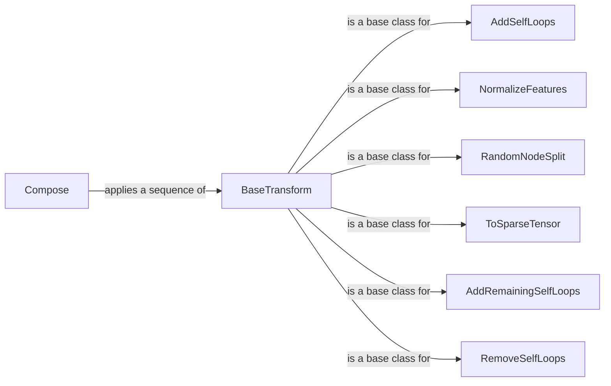

## Component Details

The Data Transformation and Augmentation component in PyTorch Geometric provides a flexible and extensible way to modify graph data before it is fed into a Graph Neural Network (GNN). It consists of a set of composable transformations that can perform tasks such as normalizing node features, adding self-loops, splitting the dataset, and converting the graph to different representations. The core idea is to prepare the data in a way that optimizes the performance and stability of the GNN model. The transformations are designed to be modular and reusable, allowing users to easily create custom pipelines for data preprocessing.

### BaseTransform
The abstract base class for all transformations in PyTorch Geometric. It defines the interface that all transformations must implement, primarily the `__call__` method, which takes a `Data` object as input and returns a transformed `Data` object. This class ensures that all transformations can be seamlessly integrated into a processing pipeline.
- **Related Classes/Methods**: `pytorch_geometric.torch_geometric.transforms.base_transform.BaseTransform`

### Compose
A transformation that composes multiple transformations into a single transformation. It takes a list of transformations as input and applies them sequentially to the `Data` object. This allows users to create complex data processing pipelines by combining simpler transformations.
- **Related Classes/Methods**: `pytorch_geometric.torch_geometric.transforms.compose.Compose`

### AddSelfLoops
A transformation that adds self-loops to the graph. Self-loops can be beneficial for certain GNN architectures, as they allow nodes to aggregate information from themselves in addition to their neighbors. The transformation can also add edge attributes for the new self-loops, with a specified fill value.
- **Related Classes/Methods**: `pytorch_geometric.torch_geometric.transforms.add_self_loops.AddSelfLoops`

### NormalizeFeatures
A transformation that normalizes the node features of the graph. Normalizing features can improve the training stability and performance of GNNs, especially when the features have different scales or distributions. The transformation typically scales the features to have zero mean and unit variance.
- **Related Classes/Methods**: `pytorch_geometric.torch_geometric.transforms.normalize_features.NormalizeFeatures`

### RandomNodeSplit
A transformation that splits the nodes of the graph into training, validation, and test sets. This is a common preprocessing step for training GNNs, as it allows for evaluating the model's performance on unseen data. The transformation randomly assigns nodes to each set based on a specified ratio.
- **Related Classes/Methods**: `pytorch_geometric.torch_geometric.transforms.random_node_split.RandomNodeSplit`

### ToSparseTensor
A transformation that converts the edge index of the graph to a sparse tensor representation. Sparse tensors can be more efficient for storing and processing graphs with a large number of nodes and edges, especially when the graph is sparse. This transformation is useful for GNN models that operate on sparse tensors.
- **Related Classes/Methods**: `pytorch_geometric.torch_geometric.transforms.to_sparse_tensor.ToSparseTensor`

### AddRemainingSelfLoops
A transformation that adds the remaining self-loops to the graph. It ensures that all nodes have self-loops. This is useful when some nodes might not have self-loops initially.
- **Related Classes/Methods**: `pytorch_geometric.torch_geometric.transforms.add_remaining_self_loops.AddRemainingSelfLoops`

### RemoveSelfLoops
A transformation that removes self-loops from the graph. This can be useful in scenarios where self-loops are not desired or can negatively impact model performance.
- **Related Classes/Methods**: `pytorch_geometric.torch_geometric.transforms.remove_self_loops.RemoveSelfLoops`
