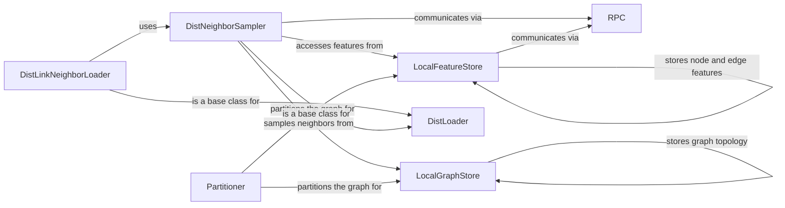

## Component Details

The Distributed Training Support component enables training large-scale Graph Neural Networks (GNNs) on massive datasets by distributing the training process across multiple devices or machines. It involves partitioning the graph data, distributing the model parameters, and synchronizing gradients. The main flow includes partitioning the graph using a Partitioner, storing graph topology and features locally using LocalGraphStore and LocalFeatureStore, sampling neighbors in a distributed manner using DistNeighborSampler, and performing remote procedure calls (RPC) for communication and data exchange between workers. The purpose is to overcome memory and computational limitations of single-machine training, allowing for the training of GNNs on graphs that would otherwise be too large to fit into the memory of a single machine.

### DistNeighborSampler
The `DistNeighborSampler` class is responsible for sampling neighbors in a distributed setting. It initializes sampler instances, registers them via RPC, and handles the actual sampling of nodes and edges across different workers. It interacts with `LocalGraphStore` and `LocalFeatureStore` to access graph data and features, and uses RPC calls to fetch data from remote workers.
- **Related Classes/Methods**: `torch_geometric.distributed.dist_neighbor_sampler.DistNeighborSampler`

### LocalGraphStore
The `LocalGraphStore` class manages the storage of graph topology (edge indices) on a local worker. It provides methods for putting, getting, and removing edge IDs and edge indices. It interacts with the `DistNeighborSampler` to provide graph structure for sampling.
- **Related Classes/Methods**: `torch_geometric.distributed.local_graph_store.LocalGraphStore`

### LocalFeatureStore
The `LocalFeatureStore` class manages the storage of node and edge features on a local worker. It provides methods for putting, getting, and removing tensors, as well as looking up features based on global IDs. It interacts with the `DistNeighborSampler` to provide features for sampled nodes and edges, and uses RPC calls to fetch remote features.
- **Related Classes/Methods**: `torch_geometric.distributed.local_feature_store.LocalFeatureStore`

### RPC
The `rpc` module provides functions for initializing, shutting down, and performing remote procedure calls (RPC) between workers. It is used by `DistNeighborSampler` and `LocalFeatureStore` to communicate and exchange data between different workers in the distributed environment.
- **Related Classes/Methods**: `torch_geometric.distributed.rpc`

### Partitioner
The `Partitioner` is responsible for partitioning the graph data across different workers. It generates partitions based on a given partitioning strategy. The partitions are then used to initialize the `LocalGraphStore` and `LocalFeatureStore` on each worker.
- **Related Classes/Methods**: `torch_geometric.distributed.partition.Partitioner`

### DistLoader
The `DistLoader` class is a base class for distributed data loaders. It handles worker initialization and cleanup. It's used as a base for loaders like `DistNeighborLoader`.
- **Related Classes/Methods**: `torch_geometric.distributed.dist_loader.DistLoader`

### DistLinkNeighborLoader
The `DistLinkNeighborLoader` class is responsible for creating mini-batches of link neighbors in a distributed setting. It leverages the `DistNeighborSampler` to sample subgraphs around the links and loads the data for training.
- **Related Classes/Methods**: `torch_geometric.distributed.dist_link_neighbor_loader.DistLinkNeighborLoader`
