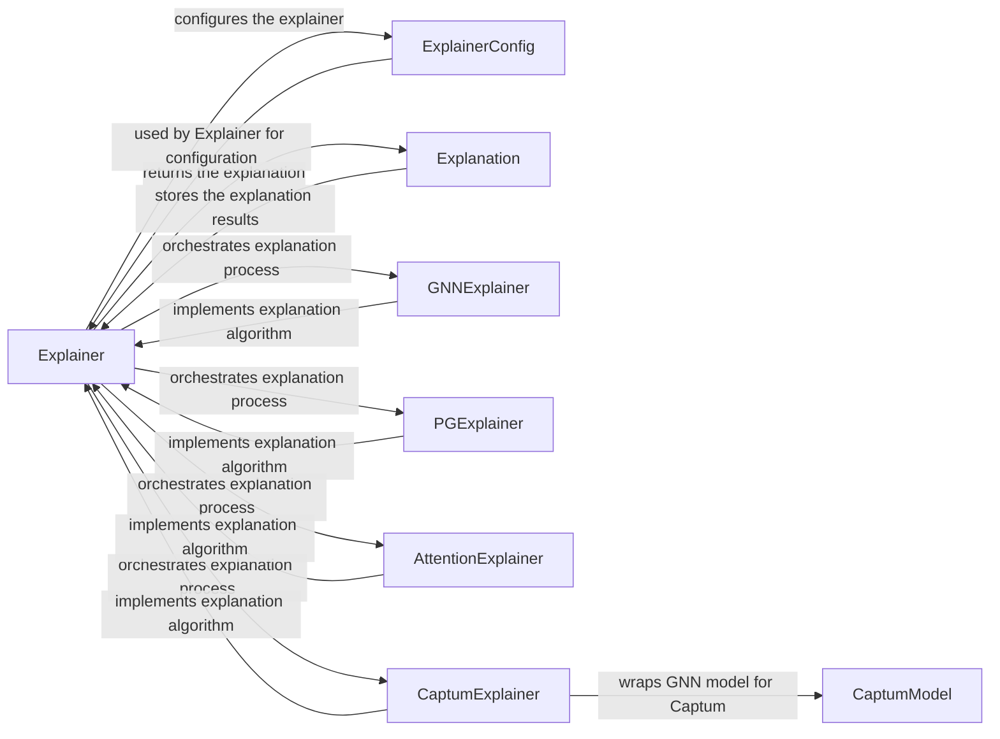

## Component Details

The Explainability Toolkit in PyTorch Geometric provides a suite of tools for understanding and interpreting the predictions made by Graph Neural Networks (GNNs). It offers various explainer algorithms that aim to identify the most influential nodes, edges, or features that contribute to a GNN's decision-making process. The toolkit's main flow involves taking a trained GNN model, input graph data, and a chosen explainer algorithm to generate an explanation, typically in the form of masks or attributions. These explanations help users gain insights into the GNN's reasoning, improve model transparency, and potentially identify biases or vulnerabilities.

### Explainer
The `Explainer` class serves as the central orchestrator for the explanation process. It takes a GNN model, input data, and an explainer algorithm, and returns an `Explanation` object. It handles configuration, prediction masking, and explanation post-processing, providing a unified interface for generating explanations.
- **Related Classes/Methods**: `torch_geometric.explain.explainer.Explainer`

### ExplainerConfig
The `ExplainerConfig` class holds the configuration parameters for the explainer, such as the explainer algorithm to use, the number of epochs for training (if applicable), and other algorithm-specific settings. It provides a centralized way to manage the explainer's behavior and customize the explanation process.
- **Related Classes/Methods**: `torch_geometric.explain.config.ExplainerConfig`

### Explanation
The `Explanation` class represents the output of the explanation process. It stores the masks (edge, node, feature) that highlight the important parts of the graph or features. It also provides methods for visualizing and manipulating the explanation, such as extracting explanation subgraphs and visualizing feature importance, enabling users to interpret and analyze the explanation results.
- **Related Classes/Methods**: `torch_geometric.explain.explanation.Explanation`, `torch_geometric.explain.explanation.ExplanationMixin`, `torch_geometric.explain.explanation.HeteroExplanation`

### GNNExplainer
The `GNNExplainer` class is an explainer algorithm that learns a mask over the edges of the graph to explain the GNN's prediction. It trains the edge mask by optimizing a loss function that encourages the masked graph to produce a similar prediction to the original graph, effectively identifying the most important edges for the prediction.
- **Related Classes/Methods**: `torch_geometric.explain.algorithm.gnn_explainer.GNNExplainer`, `torch_geometric.explain.algorithm.gnn_explainer.GNNExplainer_`

### PGExplainer
The `PGExplainer` class is an explainer algorithm that uses policy gradient methods to learn a policy for selecting important edges in the graph. It trains a policy network to generate edge masks that maximize a reward function based on the GNN's prediction, providing a reinforcement learning approach to explanation.
- **Related Classes/Methods**: `torch_geometric.explain.algorithm.pg_explainer.PGExplainer`

### AttentionExplainer
The `AttentionExplainer` class is an explainer algorithm that leverages attention weights from the GNN model to explain the predictions. It extracts attention weights from the model and uses them to create explanations by highlighting important nodes or edges, directly utilizing the model's internal attention mechanisms for explanation.
- **Related Classes/Methods**: `torch_geometric.explain.algorithm.attention_explainer.AttentionExplainer`

### CaptumExplainer
The `CaptumExplainer` class is an explainer algorithm that leverages the Captum library to compute feature attributions for GNN models. It wraps the GNN model with a `CaptumModel` and uses Captum's attribution methods to generate explanations, integrating Captum's capabilities into the PyTorch Geometric explanation framework.
- **Related Classes/Methods**: `torch_geometric.explain.algorithm.captum_explainer.CaptumExplainer`

### CaptumModel
The `CaptumModel` class is a wrapper around the GNN model that makes it compatible with the Captum library. It adapts the GNN's input and output to the format expected by Captum's attribution methods, enabling the use of Captum's explanation techniques with GNN models.
- **Related Classes/Methods**: `torch_geometric.explain.algorithm.captum.CaptumModel`, `torch_geometric.explain.algorithm.captum.CaptumHeteroModel`
