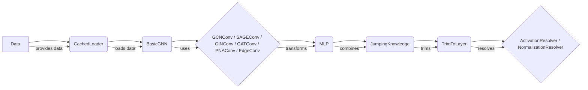

### Component Descriptions:

*   **Data**: Represents the input graph data, including node features and edge connectivity. It provides the initial data for the GNN model.
    *   **Purpose**: Stores graph data.
    *   **Interaction**: Provides data to `CachedLoader`.
    *   **Relevant source files**: `torch_geometric.data.data.Data.from_dict`

*   **CachedLoader**: Loads and caches graph data to speed up training. It reduces data loading overhead by reusing previously loaded graphs.
    *   **Purpose**: Loads and caches graph data.
    *   **Interaction**: Receives data from `Data` and provides it to `BasicGNN`.
    *   **Relevant source files**: `torch_geometric.loader.cache.CachedLoader`

*   **BasicGNN**: Base class for GNN models, handling the overall architecture and training process. It orchestrates the flow of data through the GNN layers.
    *   **Purpose**: Defines the overall GNN architecture.
    *   **Interaction**: Receives data from `CachedLoader` and uses convolutional layers (e.g., `GCNConv`) to process it.
    *   **Relevant source files**: `repos.pytorch_geometric.torch_geometric.nn.models.basic_gnn.BasicGNN`, `repos.pytorch_geometric.torch_geometric.nn.models.basic_gnn.BasicGNN.__init__`, `repos.pytorch_geometric.torch_geometric.nn.models.basic_gnn.BasicGNN.reset_parameters`, `repos.pytorch_geometric.torch_geometric.nn.models.basic_gnn.BasicGNN.forward`, `repos.pytorch_geometric.torch_geometric.nn.models.basic_gnn.BasicGNN.inference`, `repos.pytorch_geometric.torch_geometric.nn.models.basic_gnn.BasicGNN.init_conv`

*   **GCNConv / SAGEConv / GINConv / GATConv / PNAConv / EdgeConv**: Different types of graph convolutional layers that perform feature aggregation and transformation. They update node representations based on the graph structure.
    *   **Purpose**: Performs graph convolution operations.
    *   **Interaction**: Used by `BasicGNN` to process node features.
    *   **Relevant source files**: `torch_geometric.nn.conv.gcn_conv.GCNConv`, `torch_geometric.nn.conv.sage_conv.SAGEConv`, `torch_geometric.nn.conv.gin_conv.GINConv`, `torch_geometric.nn.conv.gat_conv.GATConv`, `torch_geometric.nn.conv.pna_conv.PNAConv`, `torch_geometric.nn.conv.edge_conv.EdgeConv`

*   **MLP**: Multi-layer perceptron used for transforming node features after convolution. It adds non-linearity to the model and allows it to learn complex relationships.
    *   **Purpose**: Transforms node features.
    *   **Interaction**: Used after convolutional layers to further process node features.
    *   **Relevant source files**: `torch_geometric.nn.models.mlp.MLP`

*   **JumpingKnowledge**: Combines the output of multiple graph layers. It helps to improve the representation power of GNNs by allowing them to access information from different hops.
    *   **Purpose**: Combines outputs from different GNN layers.
    *   **Interaction**: Receives outputs from multiple GNN layers and combines them.
    *   **Relevant source files**: `torch_geometric.nn.models.jumping_knowledge.JumpingKnowledge`, `torch_geometric.nn.models.jumping_knowledge.JumpingKnowledge.reset_parameters`

*   **TrimToLayer**: Trims the output of GNN layers to a specific layer. It is used in conjunction with jumping knowledge to select the output of a particular layer.
    *   **Purpose**: Selects the output of a specific GNN layer.
    *   **Interaction**: Used with `JumpingKnowledge` to select the desired layer output.
    *   **Relevant source files**: `torch_geometric.utils._trim_to_layer.TrimToLayer`

*   **ActivationResolver / NormalizationResolver**: Resolves activation functions and normalization layers from strings or callable objects. They provide a convenient way to configure the GNN model.
    *   **Purpose**: Resolves activation functions and normalization layers.
    *   **Interaction**: Used by other components to obtain activation functions and normalization layers.
    *   **Relevant source files**: `torch_geometric.nn.resolver.activation_resolver`, `torch_geometric.nn.resolver.normalization_resolver`
