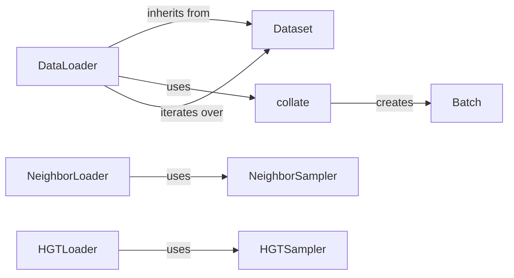

## Component Details

The Graph Data Loading and Batching component in PyTorch Geometric focuses on providing efficient data loading and batching mechanisms for training graph neural networks. It abstracts the complexities of handling graph data, offering various data loaders tailored for different sampling strategies and data formats. The component optimizes memory usage and computational efficiency by creating mini-batches from the dataset and feeding them into the training loop. It supports neighbor sampling, subgraph sampling, and specialized loaders for heterogeneous graphs, enabling users to train GNNs on diverse graph structures.

### Dataset
The `Dataset` class serves as the foundation for creating graph datasets in PyTorch Geometric. It defines the basic interface for accessing individual graphs and their labels, providing a standardized way to interact with different datasets. All datasets inherit from this class, ensuring consistency and compatibility within the PyTorch Geometric ecosystem.
- **Related Classes/Methods**: `pytorch_geometric.data.dataset.Dataset`

### DataLoader
The `DataLoader` is a PyTorch-compatible data loader customized for handling graph data. It efficiently batches graphs, shuffles data, and supports parallel data loading to optimize the training process. It uses a `Collater` object to combine individual graph samples into a batched graph representation.
- **Related Classes/Methods**: `pytorch_geometric.loader.dataloader.DataLoader`, `pytorch_geometric.loader.dataloader.Collater`

### NeighborLoader
The `NeighborLoader` is a specialized data loader designed for node-level tasks that utilizes neighbor sampling to create mini-batches. It samples nodes and their neighborhoods to generate subgraphs for training graph neural networks on large graphs. It relies on the `NeighborSampler` to perform the actual neighbor sampling.
- **Related Classes/Methods**: `pytorch_geometric.loader.neighbor_loader.NeighborLoader`

### NeighborSampler
The `NeighborSampler` is a crucial component used by the `NeighborLoader` to sample neighbors from a graph, creating subgraphs for training. It efficiently extracts relevant neighborhood information, enabling GNNs to learn from local graph structures. It is a key optimization for training on large graphs where processing the entire graph at once is infeasible.
- **Related Classes/Methods**: `pytorch_geometric.sampler.neighbor_sampler.NeighborSampler`

### HGTLoader
The `HGTLoader` is a data loader specifically designed for Heterogeneous Graph Transformer (HGT) models. It handles the complexities of heterogeneous graphs with different node and edge types, enabling training on graphs with diverse relationships. It uses `HGTSampler` to sample from heterogeneous graphs.
- **Related Classes/Methods**: `pytorch_geometric.loader.hgt_loader.HGTLoader`

### HGTSampler
The `HGTSampler` is used by the `HGTLoader` to sample neighbors from heterogeneous graphs. It is designed to handle the different node and edge types present in heterogeneous graphs, allowing for efficient training of HGT models.
- **Related Classes/Methods**: `pytorch_geometric.sampler.hgt_sampler.HGTSampler`

### Batch
The `Batch` class represents a batched graph, combining multiple individual graphs into a single data structure for efficient processing. It is created by the `collate` function and used by the data loaders to create mini-batches. This allows for parallel processing of multiple graphs, improving training speed.
- **Related Classes/Methods**: `pytorch_geometric.data.batch.Batch`

### collate
The `collate` function is responsible for combining individual graphs into a single batched graph represented by the `Batch` class. It is used by the data loaders to create mini-batches for training. This function handles the necessary data transformations to ensure that the graphs can be processed efficiently by the GNN.
- **Related Classes/Methods**: `pytorch_geometric.data.collate`
