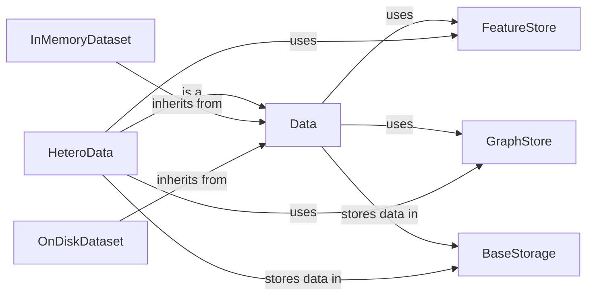

## Component Details

The Graph Data Management component in PyTorch Geometric provides the fundamental data structures and mechanisms for representing and manipulating graph data. It offers classes for storing both homogeneous and heterogeneous graphs, as well as datasets that can reside in memory or on disk. The core of this component revolves around the `Data` and `HeteroData` classes, which serve as containers for graph information such as node features, edge connectivity, and other graph-level attributes. These classes leverage `FeatureStore` and `GraphStore` to efficiently manage and access feature and connectivity data, respectively. The `InMemoryDataset` and `OnDiskDataset` classes provide convenient ways to create and manage graph datasets, while `BaseStorage` offers basic functionalities for storing data attributes. The overall purpose of this component is to provide a flexible and efficient framework for representing and processing graph data in various applications.

### Data
Represents a homogeneous graph structure. It stores node features, edge connectivity, and other graph-level attributes. It serves as a base class for representing a single graph.
- **Related Classes/Methods**: `torch_geometric.data.data.Data`

### HeteroData
Represents a heterogeneous graph structure, allowing for different types of nodes and edges. It extends the Data class to handle multiple node and edge types, enabling the representation of more complex relationships.
- **Related Classes/Methods**: `torch_geometric.data.hetero_data.HeteroData`

### InMemoryDataset
Base class for creating graph datasets that fit entirely in memory. It handles data loading and preprocessing, making it easy to create and manage datasets for graph-based machine learning tasks.
- **Related Classes/Methods**: `torch_geometric.data.in_memory_dataset.InMemoryDataset`

### OnDiskDataset
Base class for creating graph datasets that are stored on disk. It handles data loading and preprocessing for large datasets that cannot fit into memory.
- **Related Classes/Methods**: `torch_geometric.data.on_disk_dataset.OnDiskDataset`

### BaseStorage
Base class for storing data attributes. It provides basic functionalities for setting, deleting, accessing keys, values and items, serving as a foundation for data storage within the graph data structures.
- **Related Classes/Methods**: `torch_geometric.data.storage.BaseStorage`

### FeatureStore
Manages the storage and retrieval of node and edge features (tensors). It provides methods for putting, getting, and removing tensors, enabling efficient access to feature data within graphs.
- **Related Classes/Methods**: `torch_geometric.data.feature_store.FeatureStore`

### GraphStore
Manages the storage and retrieval of graph connectivity information (edge indices). It provides methods for putting, getting, and removing edge indices, enabling efficient access to graph structure data.
- **Related Classes/Methods**: `torch_geometric.data.graph_store.GraphStore`
