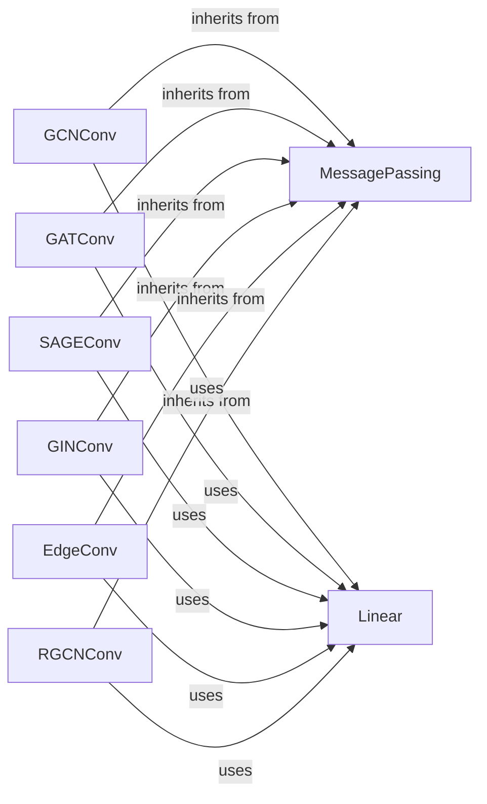

## Component Details

The Graph Neural Network Layers component provides a set of building blocks for constructing various GNN architectures. It includes a base class for message passing and several convolutional layers that implement different GNN algorithms. These layers can be combined and customized to create powerful and flexible graph learning models for various graph structures and tasks. The main flow involves defining a GNN architecture by selecting and configuring appropriate convolutional layers, which then perform message passing and node feature updates based on the graph structure and node/edge features.

### MessagePassing
The MessagePassing base class provides the infrastructure for implementing message passing graph neural networks. It handles message propagation, aggregation, and node feature updates based on messages from neighboring nodes. Custom GNN layers inherit from this class and implement the message and update functions.
- **Related Classes/Methods**: `torch_geometric.nn.conv.MessagePassing`

### GCNConv
GCNConv implements the Graph Convolutional Network layer, a fundamental GNN layer. It aggregates the features of neighboring nodes and applies a linear transformation to update the node features. It uses a normalized adjacency matrix for message aggregation.
- **Related Classes/Methods**: `torch_geometric.nn.conv.GCNConv`

### GATConv
GATConv implements the Graph Attention Network layer, which uses attention mechanisms to weight the importance of neighboring nodes during message aggregation. This allows the network to focus on the most relevant neighbors for each node.
- **Related Classes/Methods**: `torch_geometric.nn.conv.GATConv`

### SAGEConv
SAGEConv implements the GraphSAGE convolutional operator, which samples and aggregates features from a node's local neighborhood. It can be used in inductive settings where the graph structure is not known during training.
- **Related Classes/Methods**: `torch_geometric.nn.conv.SAGEConv`

### GINConv
GINConv implements the Graph Isomorphism Network layer, which uses a learnable aggregation function to distinguish between different graph structures. It is a powerful layer for graph classification tasks.
- **Related Classes/Methods**: `torch_geometric.nn.conv.GINConv`

### EdgeConv
EdgeConv applies a learnable function to the features of connected nodes and their edge features. It can be used for tasks such as point cloud analysis and dynamic graph processing.
- **Related Classes/Methods**: `torch_geometric.nn.conv.EdgeConv`

### RGCNConv
RGCNConv implements the Relational Graph Convolutional Network layer, which handles multi-relational graphs by applying different linear transformations for each relation type. It is suitable for knowledge graph embedding and reasoning tasks.
- **Related Classes/Methods**: `torch_geometric.nn.conv.RGCNConv`

### Linear
The Linear layer applies a linear transformation to the input features. It is used within the convolutional layers to transform the aggregated messages or node features.
- **Related Classes/Methods**: `torch_geometric.nn.dense.Linear`
