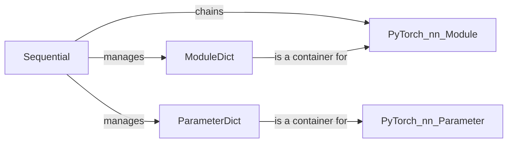

## Component Details

The Model Construction Utilities provide a set of tools and containers for building graph neural network models in a modular and flexible way. The core components include `Sequential`, `ModuleDict`, and `ParameterDict`, which facilitate the construction, management, and parameterization of GNN models. These utilities simplify the process of creating complex GNN architectures by allowing users to easily assemble different GNN layers and components into a complete model.

### Sequential
The `Sequential` container executes a sequence of modules in the order they are added. It simplifies the creation of feedforward neural networks by chaining layers together. It is a fundamental building block for constructing more complex GNN models.
- **Related Classes/Methods**: `torch_geometric.nn.sequential.Sequential`

### ModuleDict
The `ModuleDict` is a dictionary-like container that holds `nn.Module` instances. It provides a convenient way to manage and access named modules within a network, allowing for dynamic construction and modification of the model architecture.
- **Related Classes/Methods**: `torch_geometric.nn.module_dict.ModuleDict`

### ParameterDict
The `ParameterDict` is a dictionary-like container that holds `nn.Parameter` instances. It allows managing and accessing named parameters within a module, providing a structured way to handle model parameters.
- **Related Classes/Methods**: `torch_geometric.nn.parameter_dict.ParameterDict`
