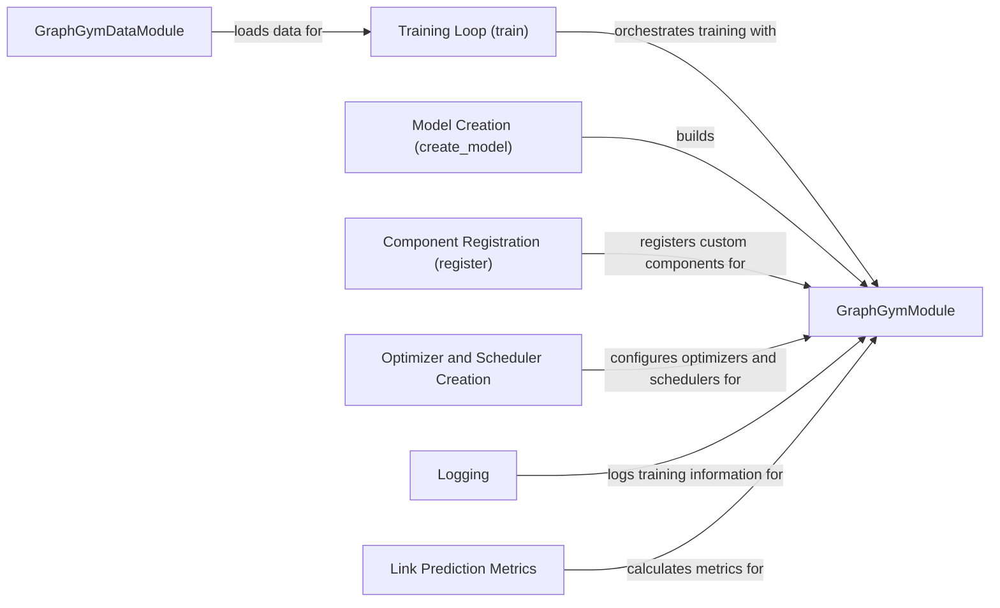

## Component Details

The Training and Evaluation Engine in GraphGym provides a comprehensive framework for training and evaluating graph neural network models. It encompasses data handling, model building, optimization, logging, and metric calculation. The engine leverages PyTorch Lightning for streamlined training and supports customization through registration of custom components. It orchestrates the training loop, manages data loading, constructs the GNN model, configures optimizers and schedulers, logs training progress, and calculates evaluation metrics, providing a standardized and efficient way to train and assess GNN models.

### GraphGymDataModule
Handles data loading and preprocessing for GraphGym models. It prepares the data for training, validation, and testing by inheriting from LightningDataModule.
- **Related Classes/Methods**: `pytorch_geometric.torch_geometric.graphgym.train.GraphGymDataModule`

### Training Loop (train)
The main training loop function. It orchestrates the training process, including forward and backward passes, optimization, and validation. It leverages PyTorch Lightning's Trainer class.
- **Related Classes/Methods**: `pytorch_geometric.torch_geometric.graphgym.train.train`

### GraphGymModule
A PyTorch Lightning module that encapsulates the GNN model and its training/validation/testing logic. It defines the model architecture, loss function, and optimization strategy.
- **Related Classes/Methods**: `pytorch_geometric.torch_geometric.graphgym.model_builder.GraphGymModule`

### Model Creation (create_model)
A function that builds the GNN model based on the provided configuration. It assembles the different layers and components of the model.
- **Related Classes/Methods**: `pytorch_geometric.torch_geometric.graphgym.model_builder.create_model`

### Component Registration (register)
A module containing functions for registering custom components such as optimizers, schedulers, losses, training procedures, and metrics. This allows users to extend the functionality of GraphGym.
- **Related Classes/Methods**: `pytorch_geometric.torch_geometric.graphgym.register`

### Optimizer and Scheduler Creation
Functions for creating optimizers (e.g., Adam, SGD) and learning rate schedulers (e.g., StepLR, CosineAnnealingLR) based on the configuration. These are used to update the model's parameters during training and adjust the learning rate to improve convergence.
- **Related Classes/Methods**: `pytorch_geometric.torch_geometric.graphgym.optim`

### Logging
Modules for logging training progress and evaluation results. It provides different logging functionalities and integrates with PyTorch Lightning callbacks to log metrics and other information at different stages of training, validation, and testing.
- **Related Classes/Methods**: `pytorch_geometric.torch_geometric.graphgym.logger`

### Link Prediction Metrics
Classes for calculating various link prediction metrics such as Recall, NDCG, Coverage, Diversity, Personalization and Average Popularity. These metrics are used to evaluate the performance of link prediction models.
- **Related Classes/Methods**: `pytorch_geometric.torch_geometric.metrics.link_pred.LinkPredMetric`, `pytorch_geometric.torch_geometric.metrics.link_pred.LinkPredRecall`, `pytorch_geometric.torch_geometric.metrics.link_pred.LinkPredNDCG`, `pytorch_geometric.torch_geometric.metrics.link_pred.LinkPredCoverage`, `pytorch_geometric.torch_geometric.metrics.link_pred.LinkPredDiversity`, `pytorch_geometric.torch_geometric.metrics.link_pred.LinkPredPersonalization`, `pytorch_geometric.torch_geometric.metrics.link_pred.LinkPredAveragePopularity`
