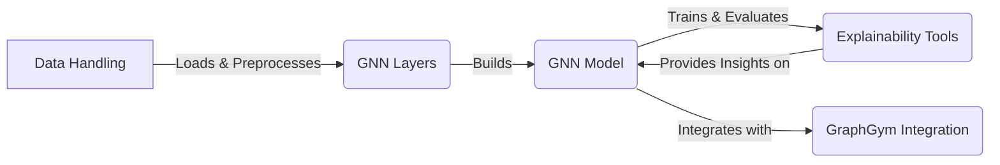

# PyTorch Geometric Data Flow Overview

PyTorch Geometric (PyG) is a library for deep learning on graphs. It provides various methods for graph data handling, graph neural network (GNN) layers, graph pooling, model building, distributed computing, explainability, and knowledge graph embeddings. It simplifies the implementation and training of GNNs for a wide range of applications.

## Component Descriptions:

**A. Data Handling:** This component is responsible for loading, processing, and batching graph data. It provides a unified interface for accessing various graph datasets and converting them into a suitable format for GNNs. It loads and preprocesses data for the GNN Layers.

**B. GNN Layers:** This component contains the implementation of various graph convolutional layers, which are the building blocks of GNNs. These layers perform message passing between nodes and edges to learn node and graph representations. It builds the GNN model.

**C. GNN Model:** This component provides tools for building and training GNN models. It includes a `BasicGNN` class that simplifies the creation of GNNs with configurable layers, normalization, and activation functions. It trains and evaluates the model and integrates with GraphGym.

**D. Explainability Tools:** This component provides tools for explaining the predictions of GNNs, including identifying important nodes and edges, and generating counterfactual explanations. It provides insights on the GNN Model.

**E. GraphGym Integration:** This component integrates PyG with GraphGym, a platform for designing and evaluating graph neural networks. It provides tools for configuring and running experiments, logging results, and comparing different models. It integrates with the GNN Model.