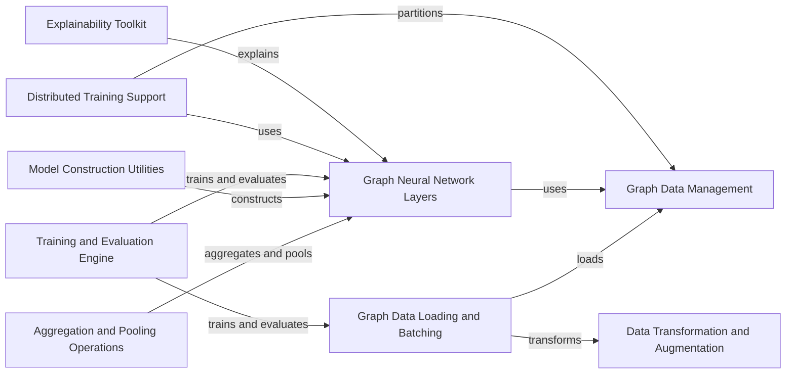

## Component Details

PyTorch Geometric (PyG) is a library for deep learning on graphs. It provides data structures and algorithms for representing and manipulating graphs, as well as a collection of graph neural network layers and models. The library supports various graph learning tasks, such as node classification, graph classification, and link prediction. PyG is built on top of PyTorch and provides a flexible and efficient framework for developing and experimenting with graph neural networks.

### Graph Data Management
This component provides the core data structures for representing graphs, including nodes, edges, and their associated features. It offers classes for storing graphs in memory or on disk, and supports heterogeneous graphs with different types of nodes and edges. It is responsible for handling the underlying graph structure and providing efficient access to graph data.
- **Related Classes/Methods**: `torch_geometric.data.Data`, `torch_geometric.data.HeteroData`, `torch_geometric.data.InMemoryDataset`, `torch_geometric.data.OnDiskDataset`, `torch_geometric.data.HyperGraphData`, `torch_geometric.data.storage.BaseStorage`, `torch_geometric.data.feature_store.FeatureStore`, `torch_geometric.data.graph_store.GraphStore`

### Data Transformation and Augmentation
This component provides a suite of transformations that can be applied to graph data to prepare it for training. These transformations include normalization, feature scaling, graph sampling, and adding self-loops. It plays a crucial role in optimizing data for specific GNN architectures and tasks, improving model performance and generalization.
- **Related Classes/Methods**: `torch_geometric.transforms.BaseTransform`, `torch_geometric.transforms.Compose`, `torch_geometric.transforms.AddSelfLoops`, `torch_geometric.transforms.NormalizeFeatures`, `torch_geometric.transforms.RandomNodeSplit`, `torch_geometric.transforms.ToSparseTensor`

### Graph Data Loading and Batching
This component focuses on efficiently loading graph data into batches for training. It provides various data loaders that support different sampling strategies and data formats. It handles the process of iterating through the dataset and providing mini-batches to the training loop, optimizing for memory usage and computational efficiency. It supports different sampling methods like neighbor sampling and subgraph sampling.
- **Related Classes/Methods**: `torch_geometric.loader.DataLoader`, `torch_geometric.loader.NodeLoader`, `torch_geometric.loader.LinkLoader`, `torch_geometric.loader.NeighborLoader`, `torch_geometric.loader.HGTLoader`, `torch_geometric.loader.ClusterLoader`

### Graph Neural Network Layers
This component provides a rich collection of graph neural network layers that can be used to build graph processing models. These layers include graph convolutional layers, graph attention layers, and other specialized layers for different graph structures and tasks. It serves as the building block for constructing various GNN architectures, enabling the creation of powerful and flexible graph learning models.
- **Related Classes/Methods**: `torch_geometric.nn.conv.MessagePassing`, `torch_geometric.nn.conv.GCNConv`, `torch_geometric.nn.conv.GATConv`, `torch_geometric.nn.conv.SAGEConv`, `torch_geometric.nn.conv.GINConv`, `torch_geometric.nn.conv.EdgeConv`, `torch_geometric.nn.conv.RGCNConv`, `torch_geometric.nn.dense.Linear`

### Aggregation and Pooling Operations
This component provides aggregation and pooling operations that are used within GNN layers to combine information from neighboring nodes and reduce the size of graphs while preserving important information. It includes various aggregation functions such as sum, mean, max, and attention-based aggregation, as well as pooling methods like global pooling, top-k pooling, and edge pooling. These operations are essential for capturing structural information and creating hierarchical graph representations.
- **Related Classes/Methods**: `torch_geometric.nn.aggr.Aggregation`, `torch_geometric.nn.aggr.SumAggregation`, `torch_geometric.nn.aggr.MeanAggregation`, `torch_geometric.nn.aggr.MaxAggregation`, `torch_geometric.nn.aggr.AttentionalAggregation`, `torch_geometric.nn.pool.global_add_pool`, `torch_geometric.nn.pool.global_mean_pool`, `torch_geometric.nn.pool.global_max_pool`, `torch_geometric.nn.pool.TopKPooling`, `torch_geometric.nn.pool.EdgePooling`, `torch_geometric.nn.pool.ASAPooling`

### Model Construction Utilities
This component provides tools and utilities for building graph neural network models. It includes classes for defining the model architecture, initializing parameters, and managing the model's state. It simplifies the process of creating complex GNN models by providing a modular and flexible framework, allowing users to easily assemble different GNN layers and components into a complete model.
- **Related Classes/Methods**: `torch_geometric.nn.Sequential`, `torch_geometric.nn.ModuleDict`, `torch_geometric.nn.ParameterDict`

### Training and Evaluation Engine
This component provides utilities for training and evaluating graph neural network models. It includes functions for defining the loss function, optimizer, and evaluation metrics. It also handles the training loop and evaluation process, providing a standardized and efficient way to train and assess GNN models. It supports various training paradigms and evaluation protocols.
- **Related Classes/Methods**: `torch_geometric.graphgym.train`, `torch_geometric.graphgym.loss`, `torch_geometric.graphgym.optim`, `torch_geometric.metrics`

### Distributed Training Support
This component supports distributed training of graph neural network models across multiple devices or machines. It includes classes for partitioning the graph data, distributing the model parameters, and synchronizing gradients. It enables the training of large-scale GNNs on massive datasets, overcoming memory and computational limitations of single-machine training.
- **Related Classes/Methods**: `torch_geometric.distributed.DistLoader`, `torch_geometric.distributed.DistNeighborSampler`, `torch_geometric.distributed.LocalFeatureStore`, `torch_geometric.distributed.LocalGraphStore`, `torch_geometric.distributed.rpc`

### Explainability Toolkit
This component provides methods for explaining the predictions of graph neural network models. It includes algorithms for identifying important nodes and edges in the graph that contribute to the model's output. It helps to understand the reasoning behind GNN predictions and improve model transparency, enabling users to gain insights into how GNNs make decisions.
- **Related Classes/Methods**: `torch_geometric.explain.explainer.Explainer`, `torch_geometric.explain.algorithm.GNNExplainer`, `torch_geometric.explain.algorithm.PGExplainer`, `torch_geometric.explain.algorithm.AttentionExplainer`