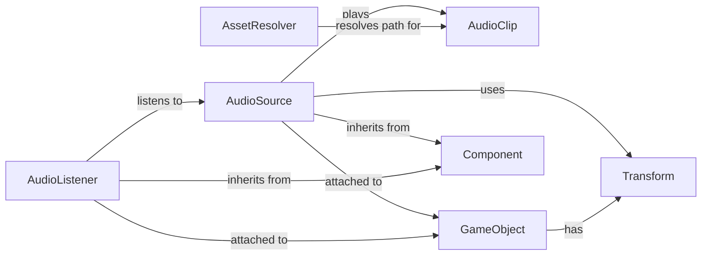

## Component Details

### AudioClip
Represents an audio clip that can be played by an AudioSource. It manages the audio data and provides methods for accessing and manipulating it. It is responsible for holding the audio data and providing access to it for playback.
- **Related Classes/Methods**: `pyunity.audio.AudioClip`

### AudioSource
A component that plays an AudioClip. It controls the playback of audio in the scene, including starting, stopping, pausing, adjusting volume, and spatial positioning. It interacts with the AudioClip to get the audio data and the AudioListener to determine the final sound output. It uses the Transform component to determine its position in 3D space.
- **Related Classes/Methods**: `pyunity.audio.AudioSource`

### AudioListener
A component that represents the listener for audio in the scene. Typically attached to the main camera, it determines where audio is heard from. It captures the audio emitted by AudioSources in the scene and simulates the effect of distance and direction on the sound.
- **Related Classes/Methods**: `pyunity.audio.AudioListener`

### AssetResolver
Resolves the path to an asset, such as an audio file. This is used to load resources from the project's asset directory. It provides a consistent way to access assets regardless of their location within the project.
- **Related Classes/Methods**: `pyunity.resources.AssetResolver`

### GameObject
A fundamental class in PyUnity, representing an object in the scene. AudioSource and AudioListener are attached to GameObjects to give them audio capabilities. It serves as a container for components.
- **Related Classes/Methods**: `pyunity.core.GameObject`

### Component
Base class for all components. AudioSource and AudioListener inherit from Component. It provides the basic functionality for all components in the PyUnity engine.
- **Related Classes/Methods**: `pyunity.core.Component`

### Transform
Component that stores the position, rotation, and scale of a GameObject. AudioSource uses the Transform component to determine its position in 3D space. It manages the spatial properties of a GameObject.
- **Related Classes/Methods**: `pyunity.core.Transform`
