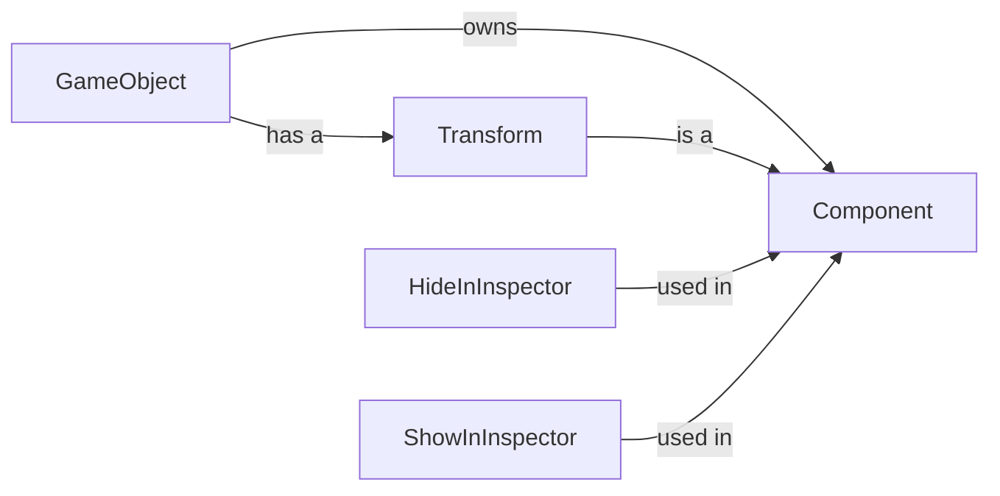

## Component Details

The Core Abstraction component in PyUnity provides the foundational elements for building game entities and their behaviors. It revolves around the GameObject, which acts as a container for Components. Components define specific functionalities, such as Transform for handling position, rotation, and scale. The system also includes mechanisms for controlling the visibility and editability of component fields in the inspector, enhancing the development workflow. This abstraction enables a modular and extensible approach to game development, where entities are constructed by attaching various components to GameObjects.

### GameObject
The GameObject is the fundamental building block of a PyUnity scene. It represents an entity in the game world and serves as a container for various Components. It provides methods for adding, removing, and managing components, allowing developers to define the behavior and appearance of game entities.
- **Related Classes/Methods**: `pyunity.core.GameObject`

### Component
Component is an abstract base class for all components that can be attached to a GameObject. It defines the basic interface for components and handles initialization and subclass registration. All custom components should inherit from this class.
- **Related Classes/Methods**: `pyunity.core.Component`

### Transform
The Transform component handles the position, rotation, and scale of a GameObject. It provides methods for manipulating these properties in both local and world space, enabling developers to control the placement and orientation of objects in the scene.
- **Related Classes/Methods**: `pyunity.core.Transform`

### HideInInspector
HideInInspector is a descriptor used to hide fields from the inspector, preventing modification of certain fields. This is useful for protecting internal state or preventing accidental changes to critical properties.
- **Related Classes/Methods**: `pyunity.core.HideInInspector`

### ShowInInspector
ShowInInspector is a descriptor used to show fields in the inspector, allowing modification of certain fields. This allows developers to expose specific properties of a component for easy editing in the editor.
- **Related Classes/Methods**: `pyunity.core.ShowInInspector`
