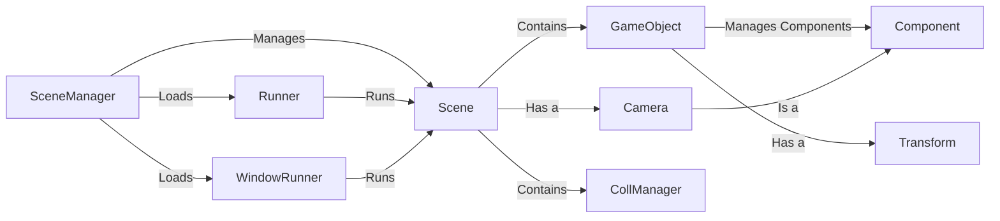

## Component Details

### GameObject
Represents an object in the scene, serving as a container for components. It manages the addition, removal, and retrieval of components. It also holds a reference to its Transform component, defining its position, rotation, and scale in the scene.
- **Related Classes/Methods**: `pyunity.core.GameObject`

### Transform
Handles the position, rotation, and scale of a GameObject. It maintains the object's transformation in the scene and its relationship to parent objects. It allows for hierarchical transformations, where changes to a parent's transform affect its children.
- **Related Classes/Methods**: `pyunity.core.Transform`

### Component
Abstract base class for all components that can be attached to a GameObject. Components define the behavior and properties of a GameObject. Examples include MeshRenderer, Collider, and custom scripts.
- **Related Classes/Methods**: `pyunity.core.Component`

### SceneManager
Manages the scenes within the application. It handles loading, adding, and switching between scenes. It also manages the active scene and provides methods for accessing and manipulating scenes.
- **Related Classes/Methods**: `pyunity.scenes.sceneManager`

### Scene
Represents a single scene in the application. It contains the GameObjects and manages their lifecycle. It also manages the physics CollManager.
- **Related Classes/Methods**: `pyunity.scenes.scene.Scene`

### Runner
Abstract base class for scene runners. It manages the game loop and scene transitions. It provides a common interface for running scenes in different environments.
- **Related Classes/Methods**: `pyunity.scenes.runner.Runner`

### WindowRunner
A concrete implementation of Runner that uses a window for rendering. It handles window creation, OpenGL setup, and rendering. It uses a window provider to create and manage the window.
- **Related Classes/Methods**: `pyunity.scenes.runner.WindowRunner`

### Camera
Represents a camera in the scene. It handles the view and projection matrices for rendering. It determines what the user sees in the scene.
- **Related Classes/Methods**: `pyunity.render.Camera`

### CollManager
Manages the physics simulation within a scene. It detects collisions between colliders and resolves them. It is contained within a Scene.
- **Related Classes/Methods**: `pyunity.physics.core.CollManager`
