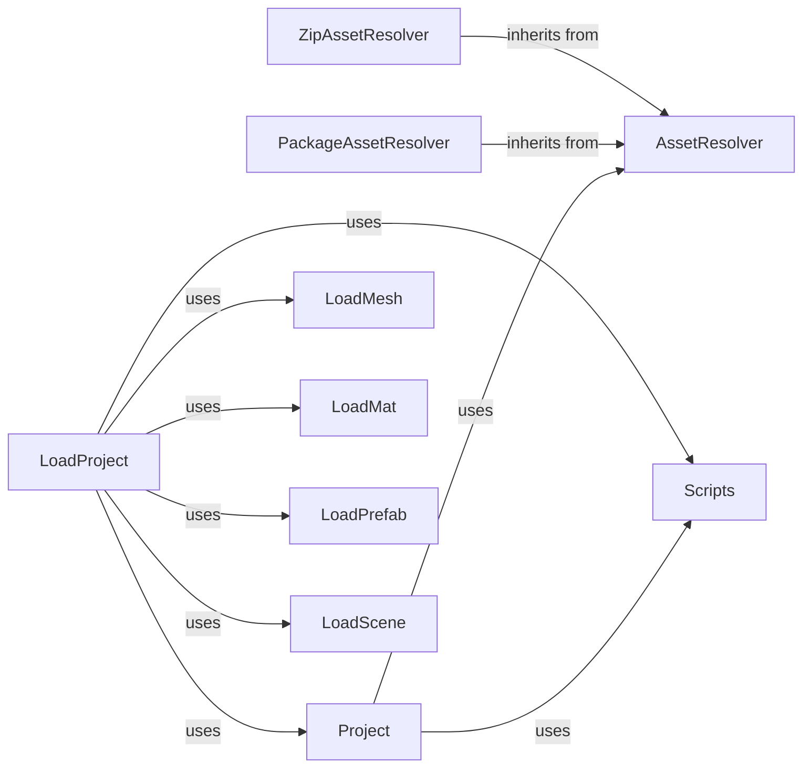

## Component Details

### Project
The Project class represents a PyUnity project. It manages the project's structure, including scenes, assets, and scripts. It provides functionalities for importing files, setting asset properties, and loading the project from a folder. It interacts with AssetResolvers to locate and load assets, and with the Scripts module to manage project scripts.
- **Related Classes/Methods**: `pyunity.files.Project`

### AssetResolver
The AssetResolver class is responsible for resolving paths to assets, checking for their existence in source and cache, and copying them if necessary. It provides a unified interface for accessing assets from different sources, such as packages and zip files. It interacts with PackageAssetResolver and ZipAssetResolver to handle specific asset locations.
- **Related Classes/Methods**: `pyunity.resources.AssetResolver`

### PackageAssetResolver
The PackageAssetResolver is a subclass of AssetResolver that specializes in resolving assets from within Python packages. It inherits the asset resolution logic from AssetResolver and customizes it to work with package resources. It is used by the AssetResolver to resolve assets from packages.
- **Related Classes/Methods**: `pyunity.resources.PackageAssetResolver`

### ZipAssetResolver
The ZipAssetResolver is a subclass of AssetResolver designed to resolve assets stored within zip files. It extends the base AssetResolver class to handle the specific requirements of accessing resources within a zip archive. It is used by the AssetResolver to resolve assets from zip files.
- **Related Classes/Methods**: `pyunity.resources.ZipAssetResolver`

### Scripts
The Scripts module handles the loading, checking, and generation of script modules. It provides functions for loading scripts from files, generating corresponding Python modules, and checking for script validity. It interacts with the Project class to load and manage project scripts.
- **Related Classes/Methods**: `pyunity.files.Scripts`

### LoadProject
The LoadProject function is responsible for loading a PyUnity project from a specified directory. It orchestrates the loading of various assets, scripts, and scenes within the project. It uses the Project class to represent the loaded project and interacts with other loader functions to load specific asset types.
- **Related Classes/Methods**: `pyunity.loader.LoadProject`

### LoadMesh
The LoadMesh function is responsible for loading a .mesh file. It is used by LoadProject to load mesh assets.
- **Related Classes/Methods**: `pyunity.loader.LoadMesh`

### LoadMat
The LoadMat function is responsible for loading a .mat file and converting it to a material. It is used by LoadProject to load material assets.
- **Related Classes/Methods**: `pyunity.loader.LoadMat`

### LoadPrefab
The LoadPrefab function is responsible for loading a .prefab file. It is used by LoadProject to load prefab assets.
- **Related Classes/Methods**: `pyunity.loader.LoadPrefab`

### LoadScene
The LoadScene function is responsible for loading a .scene file. It is used by LoadProject to load scene assets.
- **Related Classes/Methods**: `pyunity.loader.LoadScene`
