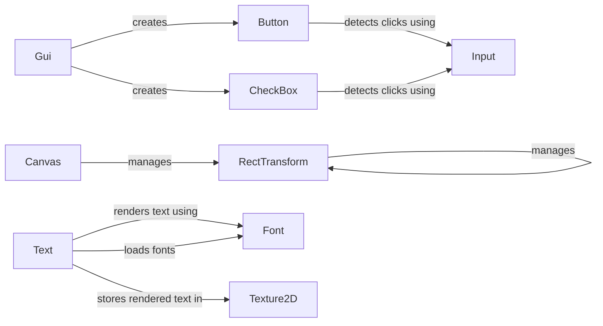

## Component Details

### Canvas
The Canvas component is responsible for managing and updating the GUI elements within a scene. It acts as the root of the GUI hierarchy, handling the overall structure and rendering of the GUI. It creates tasks and manages the rendering of all child RectTransforms.
- **Related Classes/Methods**: `repos.pyunity.pyunity.gui.Canvas`

### RectTransform
RectTransform defines the position, size, and anchoring of a GUI element. It combines RectAnchors and RectOffset to provide a flexible way to control the layout of GUI elements. It inherits from Component and manages the RectAnchors and RectOffset components.
- **Related Classes/Methods**: `repos.pyunity.pyunity.gui.RectTransform`

### Button
Button is a component that represents a clickable button on the GUI. It handles user input, detects clicks, and triggers events when clicked. It interacts with the Input class to get mouse state.
- **Related Classes/Methods**: `repos.pyunity.pyunity.gui.Button`

### Text
Text is a component that displays text on the GUI. It uses a Font to render the text and a Texture2D to store the rendered text. It generates textures and sets the image to the Texture2D.
- **Related Classes/Methods**: `repos.pyunity.pyunity.gui.Text`

### CheckBox
CheckBox is a component that represents a checkable box on the GUI. It handles user input and toggles its state when clicked. It interacts with the Input class to get mouse down events.
- **Related Classes/Methods**: `repos.pyunity.pyunity.gui.CheckBox`

### Gui
Gui is a static class that provides methods for creating GUI elements. It simplifies the process of creating buttons, checkboxes, and other GUI components. It uses GameObjects and adds components to them.
- **Related Classes/Methods**: `repos.pyunity.pyunity.gui.Gui`

### Font
Font represents a loaded font. It stores the font's data and provides methods for rendering text using the font. It is loaded by _FontLoader.
- **Related Classes/Methods**: `repos.pyunity.pyunity.gui.Font`

### Texture2D
Texture2D is a class that represents a 2D texture. It is used to store images and render them on the GUI. It is used by Text and Image2D components.
- **Related Classes/Methods**: `repos.pyunity.pyunity.files.Texture2D`

### Input
Input is a class that provides access to user input. It is used to detect mouse clicks and keyboard presses. It is used by Button and CheckBox components.
- **Related Classes/Methods**: `repos.pyunity.pyunity.input.Input`
