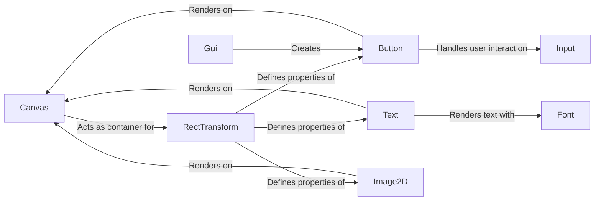

## Component Details

The Graphical User Interface (GUI) subsystem in PyUnity provides a set of tools for creating interactive user interfaces within the game engine. It encompasses components like Canvas, RectTransform, Image2D, Button, Text, and CheckBox, enabling developers to design menus, dialog boxes, and other UI elements. The GUI is rendered by the Rendering Pipeline and interacts with the Input Event Handling component for user input. The Canvas acts as the root container, managing the rendering and updating of all GUI elements. RectTransform defines the layout and positioning of elements within the Canvas. Other components like Image2D, Button, Text, and CheckBox provide specific UI functionalities. Font loading is handled by platform-specific loaders.

### Canvas
The Canvas component serves as the root container for all GUI elements. It manages the rendering and updating of the GUI, ensuring elements are displayed correctly and respond to user interactions. It provides the drawing context for all elements.
- **Related Classes/Methods**: `pyunity.gui.Canvas`

### RectTransform
The RectTransform component defines the position, size, and anchor of a GUI element. It provides the layout and positioning information necessary for arranging GUI elements within the Canvas. It is the base for all UI element positioning.
- **Related Classes/Methods**: `pyunity.gui.RectTransform`

### Button
The Button component creates an interactive button on the GUI. It handles user clicks and other interactions, triggering specific actions within the game. It uses the Input component to detect clicks.
- **Related Classes/Methods**: `pyunity.gui.Button`

### Text
The Text component renders text on the GUI. It uses the Font component to display text in a specific style and size, allowing developers to incorporate textual information into the user interface. It is positioned by the RectTransform.
- **Related Classes/Methods**: `pyunity.gui.Text`

### Image2D
The Image2D component is responsible for displaying 2D images on the GUI. It allows developers to incorporate visual elements into the user interface. It is positioned by the RectTransform.
- **Related Classes/Methods**: `pyunity.gui.Image2D`

### Input
The Input component handles user input, such as mouse clicks and keyboard presses. It provides the necessary information for interacting with GUI elements, especially buttons and checkboxes.
- **Related Classes/Methods**: `pyunity.input.Input`

### Font
The Font component loads and manages font data for rendering text. It provides the necessary information for displaying text in a specific style and size. It is used by the Text component.
- **Related Classes/Methods**: `pyunity.gui.Font`

### Gui
The Gui component provides methods for creating GUI elements. It acts as a factory for creating buttons, checkboxes, and other UI elements. It simplifies the creation of UI elements.
- **Related Classes/Methods**: `pyunity.gui.Gui`
